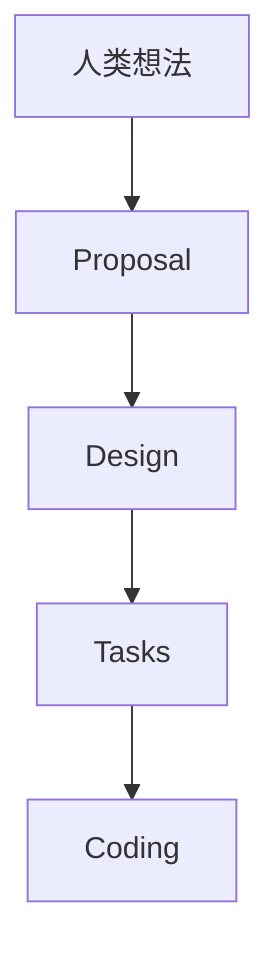

# OpenSpec 落地

## SDD 规范驱动开发

SDD 是一种全新软件工程范式。一个标准的 SDD 流程，通常将开发拆分为四个严密的阶段，把自然语言逐步具象化为代码：



- 提议阶段：共同明确“要做什么”
- 设计阶段：先让 AI 根据现有架构，出一份详细的技术方案，对齐颗粒度
- 任务拆解阶段：把设计方案变成一个原子化的、可勾选的 TODO 列表
- 编码实施阶段：交付 AI 实现

## OpenSpec 简介

OpenSpec 是目前开源社区比较热的轻量级 SDD 框架，属于 Spec 工作流框架。核心哲学是“流动的，而非死板的”。

它把每次变更变成一个独立的文件夹（`openspec/changes/name`），里面包含 `proposal.md`、`design.md`、`tasks.md`，实现更改隔离。

## OpenSpec 落地

在 OpenSpec 规范（规范驱动开发 Spec-Driven Development, SDD）体系下，项目结构最大的特点是：规格文档（Specification）拥有与源代码同等重要的地位，甚至以“规格为源”来反向映射和约束代码结构。

OpenSpec 项目通常会引入一个专用的 `.openspec/` 目录（或在 `docs/` 下）来管理变更和系统规格，并与源代码（如 `src/`）形成严格的映射。

```plaintext
my-project/
├── .openspec/                  # OpenSpec 框架的核心目录（通常由 CLI 工具管理）
│   ├── config.json             # 框架配置文件（定义技术栈、AI 指令别名等）
│   ├── active_change/          # 【核心】当前正在进行的变更上下文（Delta Spec）
│   │   ├── proposal.md         # 变更提案（为什么做、做什么）
│   │   ├── design.md           # 技术设计（架构调整、接口设计、数据库表变化）
│   │   ├── specs.md            # 精确规格（以 Given/When/Then 描述的业务场景）
│   │   └── tasks.md            # 战术实施待办列表（AI 执行时的 Task 凭据）
│   └── archive/                # 历史变更归档区（每一次迭代归档一个目录）
│       ├── 202607_add_payment/
│       └── 202608_auth_upgrade/
├── docs/                       # 主规范区（系统目前的“最终真相”，由 active_change 合并而来）
│   ├── architecture.md         # 全局架构说明
│   └── domain/                 # 领域业务规格说明书（按限界上下文划分）
│       ├── order/              # 订单领域主规格
│       └── user/               # 用户领域主规格
├── src/                        # 源代码目录（严格与主规范在战术上映射）
│   ├── domain/                 # 领域层：纯净的业务实体、值对象与逻辑（无外部依赖）
│   │   └── order/              # 对应 docs/domain/order/
│   │       ├── entities.ts
│   │       └── services.ts
│   ├── services/               # 应用层：用例编排（如下单流程：扣库存 -> 清购物车）
│   ├── http/                   # 接口层：处理请求响应、路由、鉴权
│   └── repo/                   # 基础设施层：数据持久化具体实现
├── tests/                      # 测试目录
│   ├── integration/            # 集成测试（严格对照 specs.md 中的业务场景）
│   └── unit/                   # 单元测试
└── package.json / README.md
```

### 核心拆解

#### 1. 核心区：`.openspec/active_change/`

这是 OpenSpec 开发的核心。当你想让 AI 或团队开发一个新功能时，首先要在这个目录下定义好四大文档：

- `proposal.md`（提案）：明确业务价值和边界，防止需求漂移。
- `design.md`（设计）：明确技术怎么实现。如果是前端，这里会写清楚组件层级和状态流向；如果是后端，会写清楚 API 定义和表结构。
- `specs.md`（规格）：使用 BDD（行为驱动开发）的 Given / When / Then 格式书写。这是给 AI 的精密控制马鞍，也是测试用例的唯一源头。
- `tasks.md`（任务）：拆分成非常具体的原子任务（例如：`[ ] 步骤1：在 domain/order 中创建 OrderEntity`）。AI 会严格根据 `tasks.md` 逐项打勾去写代码。

#### 2. 单一源：`docs/domain/`

这里存放的是“活文档”。当 `active_change` 中的任务全部开发完毕、测试通过后，通过 `openspec archive` 指令，当前的增量规范（Delta Spec）会被合并到 `docs/domain/` 对应领域的主规范中。这就确保了文档永远不会落后于代码。

#### 3. 代码落地：`src/`

OpenSpec 强烈推荐战术 DDD（领域驱动设计）的分层架构。代码的目录层级与 `docs/` 中的规格是像素级对应的：

| OpenSpec 规范结构 | 对应的代码产出物 | 职责说明 |
| --- | --- | --- |
| 领域 (Domain) | `src/domain/` | 一个领域目录对应一个限界上下文（如 Order, User），只包含纯业务逻辑。 |
| 需求 (Requirement) | `src/services/` | 应用服务。串联多个领域服务，管理事务与安全。 |
| 场景 (Scenario) | `tests/integration/` | 使用测试代码（如 Jest/Vitest）对 Given/When/Then 的场景进行对齐实现。 |
| 实施任务 (Tasks) | 具体的代码行 (Commit) | 最终将实体、仓储接口等落地。 |

### 实战演示

在 OpenSpec 规范下，你和 AI 的协作不是直接写代码，而是“规格先行”：

- 规划期：运行 `/opsx:propose "添加微信支付功能"`，系统会在 `.openspec/active_change/` 下生成四大文档的模板。
- 对齐期：你和 AI 共同把 `proposal`、`design` 和 `specs` 补全。确认无误后，AI 会把它们拆解成 `tasks.md`。
- 执行期：输入 `/opsx:apply`，AI 锁定 `active_change` 上下文，只根据 `tasks.md` 的指引去修改 `src/` 下的代码，不乱写、不瞎发挥。
- 验证与归档：运行 `/opsx:verify` 检查代码和测试是否完全符合 `specs.md`。通过后运行 `/opsx:archive`，将本次变更合并入主文档库并归档。

### 总结

这种结构的核心目的，就是把人类的业务意图，变成一个高确定性、结构化的“安全套件（Harness）”，罩住 AI 的生成行为，从而确保大型项目在 AI 深度参与下依然不崩盘。
