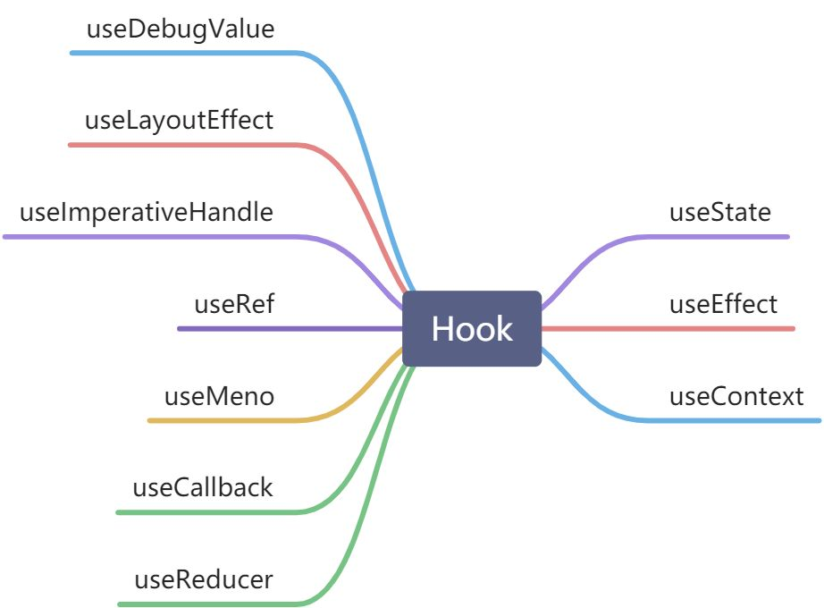

# React Hook

hook是React16.8的新增特性。它可以让你在不编写class的情况下使用state以及其他的React特性。

## hook的动机（目的、好处）
1. 组件之间复用状态逻辑很难，render、props等抽象层组成的组件会形成"嵌套地狱"
2. 复杂组件变得难以理解，组件起初很简单，但是逐渐会被状态逻辑和副作用充斥，组件变成臃肿难以复用维护。hook将组件中相互关联的部分拆分成更小的函数（比如订阅或请求数据）——>    effect hook体现
3. 难以理解的class。class是学习React的一大屏障，必须去理解JavaScript中this的工作方式、绑定事件处理器，并且没有稳定的语法提案。即使在有经验的React开发者之间，对于函数组件与class组件的差异也存在分歧，甚至要区分两种组件的使用场景。hook可以在非class的情况下使用更多的React特效。




## useState
useState函数用于更新state。它接收一个新的state值并将组件的一次重新渲染加入队列。

```javascript
const [state, setState] = useState(0)
```

**调用 useState方法的时候做了什么？** 它定义一个"state"变量。这是一种在函数调用时保存变量的方式——useState是一种新方法，它与class里面的this.state提供的功能完全相同。一般来说，在函数退出后变量就会"消失"，而state中的变量会被React保留<font style="color:#F5222D;">(</font><font style="color:#F5222D;">这里是闭包吗？不会被回收</font><font style="color:#F5222D;">)</font>

**useState需要哪些参数？** useState()方法唯一的参数就是初始state。不同于class的是，我们可以按照需要使用数字或者字符串对其进行赋值，而不一定是对象。

**useState方法的返回值是什么？** 返回值为：当前state以及更新state的函数。

**React在开发环境中可能会<span style="color:#DF2A3F;">两次调用你的更新函数</span>来验证其是否为<span style="color:#DF2A3F;">纯函数</span>。**

**hook的写法和class的写法对比**

```javascript
class Example extends React.Component {
	  constructor(props) {
    super(props)
    //	声明state变量
    this.state = {
      count: 0
    }
    render() {
    	return (
        //	读取state变量
      	<p>You clicked {this.state.count} times</p>
      	//	更新state变量
        <button onClick={() => this.setState({ count: this.state.count + 1 })}>
          Click me
        </button>
      )
    }
}
```

```javascript
function Example () {
  //	声明state变量
	const [count, setCount] = useState(0)
  return (
    //	读取state变量
  	<p>You clicked {count} times</p>
    //	更新state变量
    <button onClick={() => setCount(count + 1)}>
      Click me
    </button>
  )
}
```

## useEffect
useEffect接收一个包含命令式、且可能有副作用代码的函数。<font style="color:#F5222D;">（副作用代码指数据获取、设置订阅以及改变DOM等操作）</font>

useEffect可以看做是componentDidMount、componentDidUpdate、componentWillUnmount这三个生命周期函数的组合。与componentDidMount、componentDidUpdate不同的是，使用useEffect调度不会阻塞浏览器更新屏幕。

useEffect在每次渲染的时候都会执行。如果想执行只运行一次的 effect（仅在组件挂载和卸载时执行），可以传递一个空数组（`[]`）作为第二个参数。这就告诉 React 你的 effect 不依赖于 props 或 state 中的任何值，所以它永远都不需要重复执行。通过传递数组作为第二个可选参数进行对比，如果数组没有发生变化则不会执行。

## useRef
```javascript
const ref = useRef(initiaValue)
```

useRef返回一个可变的ref对象，.current属性被初始化为传入的参数(initialValue)。返回的ref对象在组件的整个生命周期内保持不变。

useRef()类似于ref属性，是一种访问DOM的主要方式。

**useRef和useState的不同之处**

| ref | state |
| --- | --- |
| useRef(initialValue)返回{current: initialValue} | useState(initialVale)返回state变量的当前值和一个state设置函数（[value, setValue]） |
| 更改时不会触发重新渲染 | 更改时触发重新渲染 |
| 可变，可以在渲染过程之外修改和更新current的值 | 不可变，必须使用state设置函数来修改state变量，从而排队重新渲染 |
| 不应在渲染期间读取或写入current值 | 可以随时读取state |

## useCallback
```javascript
const callback = useCallback(
	() => {
		doSomething(a,b)
	},[a,b]
)
```

useCallback返回一个memoized（缓存的）回调函数。将内联回调函数及依赖项数组作为参数传入useCallback，它将返回该函数的memoized版本，该回调函数仅在某个依赖项改变时才会更新，可以避免不必要的渲染（例如shouldComponentUpdate）。

用法:

+ **跳过组件的重新渲染**

默认情况下，当一个组件重新渲染时，React将递归渲染它的所有子组件，可以使用memo包裹。

在JavaScript中，function(){}或者()=>{}总是会生成不用的函数。所以memo会不生效。

+ **从记忆化回调中更新state**
+ **防止频繁触发Effect**
+ **优化自定义Hook**

## useMemo
```javascript
const memoizedValue = useMemo(() => computeExpensiveValue(a,b),[a,b])
```

useMemo返回一个memoized（具有缓存的值）。

用法：

+ 跳过代价昂贵的重新计算
+ 跳过组件的重新渲染
+ 记忆另一个Hook的依赖
+ 记忆一个函数

把“创建”函数和依赖项数组作为参数传入 useMemo，它仅会在某个依赖项改变时才重新计算 memoized 值。这种优化有助于避免在每次渲染时都进行高开销的计算，可以作为一种性能优化的手段。

useMemo 的第一个参数就是一个函数，这个函数返回的值会被缓存起来，同时这个值会作为 useMemo 的返回值，第二个参数是一个数组依赖，如果数组里面的值有变化，那么就会重新去执行第一个参数里面的函数，并将函数返回的值缓存起来并作为 useMemo 的返回值 。

如果没有提供依赖项数组，useMemo 在每次渲染时都会计算新的值。

**useCallback和useMemo都是用于性能优化的钩子函数。**

返回值类型：useCallback返回一个缓存的回调函数，**缓存函数本身**；useMemo返回一个缓存的值，**缓存函数调用的结果**。

使用场景：useCallback适用于优化回调函数，useMemo适用于优化计算开销较大的值。

## useReducer
useReducer是一个React Hook，它允许你向组件里面添加一个reducer。

```javascript
function reducer(state, action) {}
const [state, dispatch] = useReducer(reducer, initialArg, init?)
```

参数

reducer：用于更新state的纯函数；

initialArg：用于初始化state的任意值；

init：用于计算初始值的函数，可选

返回值

返回一个由两个值组成的数组

state。初次渲染时，它是init(initialArg)或initialArg（如果没有init函数）

dispatch函数，用于更新state并触发组件的重新渲染

<font style="color:#DF2A3F;">注意：</font>

1. state是只读的。即使是对象或数组也不要尝试修改它。正确的做法是返回新的对象。可以使用Immer库来减少重复的代码。
2. 避免重新创建初始值，如果用函数返回一个初始值，在每一次渲染的时候都会被调用。可以通过useReducer的第三个参数传入初始化函数来解决。注意的是传入的参数是init这个函数自身，而不是执行init函数后的返回值，这样传参就可以保证初始化函数不会再次运行。

## useContext
useContext可以读取和订阅组件中的context

用法：

+ 向组件树深层传递数据
+ 通过context更新传递的数据
+ 指定后备方案默认值
+ 覆盖组件树一部分的context
+ 在传递对象和函数时优化重新渲染

**使用context之前**

只想把一些props传递到多个层级中并不意味着需要把这些信息放到context。

代替方案：

+ 从传递props开始
+ 抽象组件并将JSX作为children传递给它们

**使用场景：**

+ 主题
+ 当前账户
+ 路由
+ 状态管理