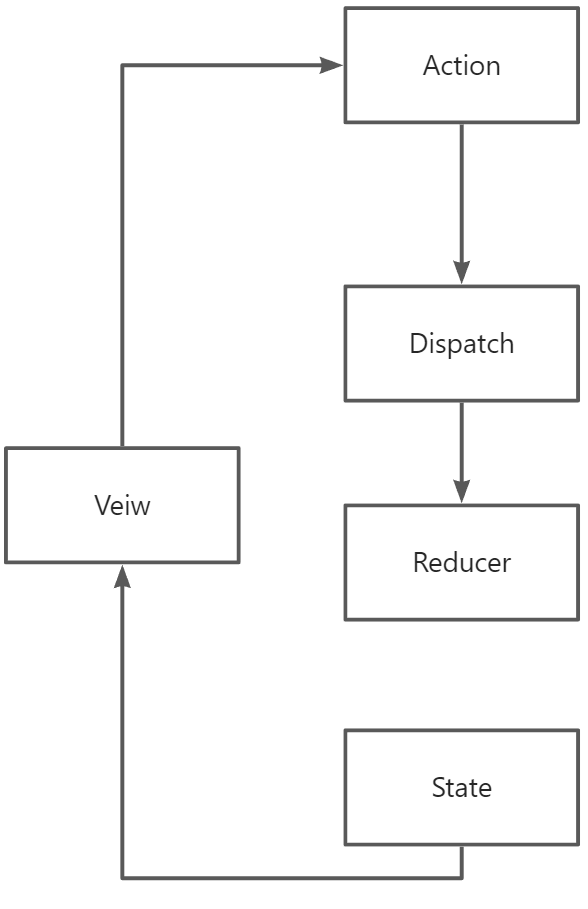

# React状态管理方案

**圣经**：[https://github.com/AwesomeDevin/blog/issues/81](https://github.com/AwesomeDevin/blog/issues/81)

## Redux
Redux是JavaScript应用的状态容器，提供可预测的状态管理。

- **createStore**: 实际创建一个Redux存储实例
- **combineReducers**: 将多个reducer函数合并成为一个更大的reducer
- **applyMiddleware**: 将多个中间件组合成一个store增强器
- **compose**: 将多个store增强器合并成一个单一的store增强器

传统的写法需要手动配置很多内容：

1. 定义Action Types constants/todos.js
2. 创建Action Creators actions/todos.js
3. 编写Reducers reducers/todos.js
4. 配置Store store/todos.js
5. 创建Middleware

## Redux Toolkit (RTK)
Redux Toolkit是官方推荐的编写Redux逻辑的方法，简化了配置Store、创建Reducer并编写Immutable更新逻辑。

### 关键API
- **configureStore**: 通过函数调用设置一个配置完善的Redux store，包括合并reducer、添加thunk中间件（异步操作，redux-thunk）、设置Redux DevTools集成
- **createSlice**: 使用Immer库编写reducer

使用步骤：
1. 使用 createSlice 定义State和Reducers
2. 使用 configureStore 配置Store
3. 简化的 createAsyncThunk 处理异步操作

### redux使用redux-persist进行数据持久化
redux-persist将redux的store中的数据自动缓存到浏览器的localStorage中。  
[https://cloud.tencent.com/developer/article/2054558](https://cloud.tencent.com/developer/article/2054558)

## React-Redux
React-Redux是一个与Redux结合使用的库，提供了将Redux和React集成的工具，`<Provider>`组件和connect函数来实现这种连接。

- **useSelector**: 允许使用一个selector函数从Redux store中提取数据（每当useSelector返回的值为新引用时，组件就会重新渲染）。
- **useDispatch**: 返回一个队Redux store中的dispatch函数的引用，可以按需使用它来dispatch action。
- **useStore**: 返回一个Redux store引用，该store与传递给`<Provider>`组件的store相同。不应该频繁使用这个hook。

## Redux-thunk
Redux Thunk是Redux的一个中间件，用于处理异步action。它允许action creators返回一个函数而不仅仅是一个普通的action对象，这个函数可以执行异步操作（如发起网络请求），然后在操作完成后再dispatch action，从而实现异步流程的管理。

## Redux-saga
Redux saga是一个用于管理应用程序副作用的库（例如异步请求和访问浏览器缓存），基本ES6的Generator功能来编写异步代码。

### redux-thunk和redux-saga的区别
- **redux-thunk**: 简单的中间件，允许在action中返回函数而不是普通的action对象。
- **redux-saga**: 复杂的中间件，通过定义saga函数处理复杂的异步流程和副作用，并发处理、取消请求等场景。

## Mobx
Mobx是一个类似于redux、flux的状态管理器，不过它比redux更加简洁、小巧。

## Dva
Dva是一个基于redux和redux-saga的数据流方案，还内置了react-router和fetch，可以理解为一个轻量级的应用框架。

### redux和react-redux的区别
[https://www.cnblogs.com/sanhuamao/p/13773556.html](https://www.cnblogs.com/sanhuamao/p/13773556.html)

## Zustand
Zustand是基于Flux模型实现的小型、快速和可扩展的状态管理解决方案，拥有基于hooks的舒适的API，非常灵活且有趣。

### 与redux比较
- 将hook作为消费状态的主要手段
- 不需要使用context provider包裹应用程序
- 可以做到瞬时更新（不引起组件渲染完成更新过程）

### 与react Context比较
- 不依赖react上下文，引用更加灵活
- 当状态发生变化时重新渲染的组件更少
- 集中的、基于操作的状态管理

### 与pinia比较
- 基于不可变状态进行更新，store更新操作相对更加可控
- 将composition api作为消费状态的主要手段，而不是Vue.use全局注入