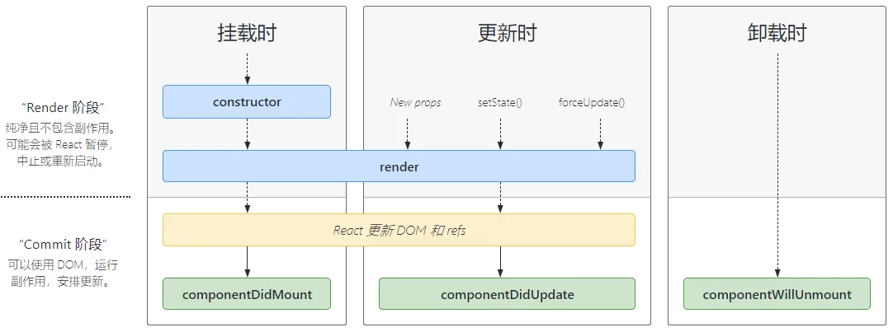

# React 生命周期

React 生命周期需要分为以下几个阶段：
- **Mounting（挂载时）**
- **Updating（更新时）**
- **Unmounting（卸载时）**

## 1. constructor()

如果不初始化 state 或不进行方法绑定，则不需要为 React 组件实现构造函数。

React 组件挂载之前，会调用它的构造函数。React.Component 子类实现构造函数时，需加上 `super(props)`。

在 `constructor()` 函数中不要调用 `setState()` 方法。

避免将 props 的值复制给 state，可以直接使用 `this.props.color`，但这可能会产生新的 bug（更新 props 值并不会影响 state）。

避免在构造函数中引入任何副作用或订阅。如有需求，将对应的操作放置在 `componentDidMount` 中。

过时的 API，使用 Hook 时没有这个生命周期，可以使用 `useState` 初始化状态和 `useEffect` 进行副作用处理。

## 2. render()

`render()` 方法是 class 组件中唯一必须实现的方法。

`render()` 函数应该为纯函数。

当 `render` 被调用时，它会检查 `this.props` 和 `this.state` 的变化并返回以下类型之一：
- React 元素
- 数组或 fragment
- Portals
- 字符串或数值类型
- 布尔类型或 null

## 3. componentDidMount()

`componentDidMount()` 会在组件挂载后（插入 DOM 树中）调用。此处适合发送请求获取数据，添加订阅。

可以在 `componentDidMount()` 里直接调用 `setState()`。这将触发额外渲染，导致性能问题，但此渲染会发生在浏览器更新屏幕之前。

## 4. componentDidUpdate()

`componentDidUpdate()` 在更新后会立即调用，首次渲染不会执行该方法。当组件更新后，可以在此处对 DOM 进行操作、对比。

可以在 `componentDidUpdate()` 里直接调用 `setState()`，但注意它必须被包裹在一个条件语句里，否则会导致死循环。

当 `shouldComponentUpdate()` 返回值为 false，则不会调用 `componentDidUpdate()`。

## 5. componentWillUnmount()

`componentWillUnmount()` 在组件卸载及销毁之前直接调用。此处适合执行必要的清理操作（清除定时器，取消网络请求，清除订阅）。

`componentWillUnmount()` 中不应调用 `setState()`，该组件永远不会重新渲染。

`componentDidMount`、`componentDidUpdate`、`componentWillUnmount` 等同于函数组件中调用 `useEffect`。

## 6. shouldComponentUpdate()

当 props 或 state 发生变化时调用，返回值默认为 true。首次渲染或使用 `forceUpdate()` 时不会调用该方法。

返回 false 并不会阻止子组件在 state 更改时重新渲染，不会调用 `componentWillUpdate()`、`render()` 和 `componentDidUpdate()`。

问题 1：`shouldComponentUpdate()` 与 `PureComponent` 组件，两者何时使用？

## 7. getDerivedStateFromProps()

在调用 `render` 方法之前调用，并且在初始挂载及后续更新时都会被调用。它应返回一个对象来更新 state，如果返回 null 则不更新任何内容。适合实现 `<Transition>` 组件。此方法无权访问组件实例。

## 8. forceUpdate()

强制让组件重新渲染。

## 9. 过时的生命周期方法（React 17 正式废弃）

### 9.1 componentWillMount()

它在 `render()` 之前调用，因此在此方法中同步调用 `setState()` 不会触发额外渲染。

一般情况下，建议在 `constructor` 中初始化 state。

`componentWillMount()` 在挂载之前被调用；`componentDidMount()` 在组件挂载后调用。

此方法是服务端渲染唯一会调用的生命周期函数。

### 9.2 componentWillReceiveProps()

在挂载的组件接受新的 props 之前调用。

使用此生命周期方法通常会出现 bug 和不一致性。

### 9.3 componentWillUpdate()

当组件收到新的 props 或 state 时，会在渲染之前调用，初始渲染不会调用此方法。

`componentWillUpdate()` 此方法可以替换为 `componentDidUpdate()`。