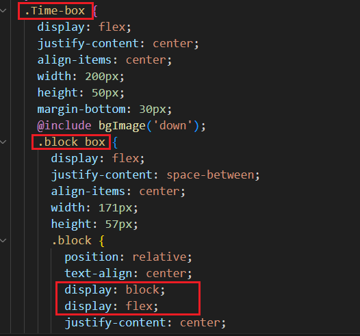
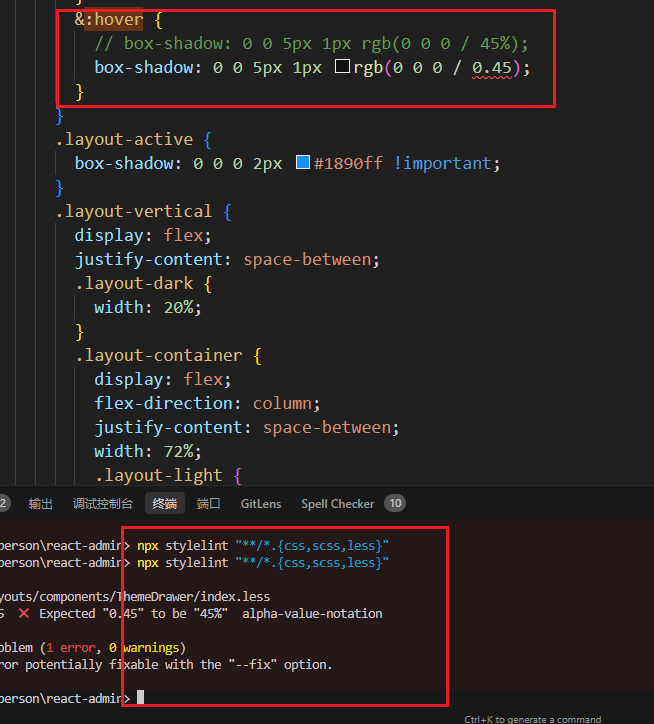

# （七）：代码规范

## Prettier

Prettier 是什么，我们看下官网的介绍：

> - 有态度的代码格式化器
> - 支持多种语言
> - 与大多数编辑器集成
> - 几乎没有配置

总结一下，Prettier 是一个代码格式化工具，保持时可以自动格式化代码，保持代码风格一致。


### 安装

```bash
npm install --save-dev --save-exact prettier
```

然后创建 `.prettierrc` 文件，添加配置，创建 `.prettierignore` 文件，添加忽略的文件。

```js
// .prettierrc
module.exports = {
  // 指定每行代码的最大长度
  printWidth: 130,
  // 指定缩进的空格数或制表符数
  tabWidth: 2,
  // 使用制表符进行缩进（true：使用制表符，false：使用空格）
  useTabs: false,
  // 在语句末尾添加分号（true：添加，false：不添加）
  semi: true,
  // 使用单引号表示字符串（true：单引号，false：双引号）
  singleQuote: false,
  // 确定对象字面量中属性名是否使用引号（"as-needed|consistent|preserve"）
  quoteProps: "as-needed",
  // 在 JSX 中使用单引号而不是双引号（true：单引号，false：双引号）
  jsxSingleQuote: false,
  // 在多行对象和数组中打印尾随逗号（"none|es5|all"）
  trailingComma: "none",
  // 在对象字面量和数组的括号之间添加空格，如 "{ foo: bar }"（true：添加，false：不添加）
  bracketSpacing: true,
  // 将 JSX 元素的 > 放在最后一行的末尾，而不是单独放在新行（true：放在末尾，false：放在新行）
  bracketSameLine: false,
  // 箭头函数只有一个参数时是否使用括号（avoid：省略括号，always：总是使用括号）
  arrowParens: "avoid",
  // 指定要使用的解析器，不需要在文件开头包含 @prettier
  requirePragma: false,
  // 在文件顶部插入一个特殊的 @format 标记，表示该文件已经被 Prettier 格式化
  insertPragma: false,
  // 控制文本如何换行（preserve：不换行）
  proseWrap: "preserve",
  // 定义 HTML 中的空格是否敏感（"css"：遵循 CSS display 属性的默认值，"strict"：空格敏感，"ignore"：空格不敏感）
  htmlWhitespaceSensitivity: "css",
  // 定义用于格式化的行尾字符（"auto|lf|crlf|cr"）
  endOfLine: "auto",
  // 这两个选项可用于格式化从给定字符偏移量开始和结束的代码（rangeStart：开始，rangeEnd：结束）
  rangeStart: 0,
  rangeEnd: Infinity
};
```

prettierrc内容如上，具体配置可以参考[Prettier 官网](https://prettier.io/)。


```bash
# .prettierignore
/dist/*
.local
/node_modules/**

**/*.svg
**/*.sh

/public/*
stats.html
```

prettierignore内容如上，需要忽略的文件根据实际情况添加。

### 使用

以上的内容准备完成后，就可以使用 Prettier 格式化代码了。

```bash
npx prettier --write .
```

使用npx执行命令，会格式化当前目录下的所有文件。终端输出如下，你也可以通过 git 查看文件的改动。


### 集成

Prettier 可以集成到编辑器中，以下以 VSCode 为例。

1. 安装 Prettier - Code formatter 插件
2. 因为希望每个项目使用不同的 Prettier 配置，在项目根目录创建 `.vscode` 文件夹，创建 `settings.json` 文件，添加配置：

```json
{
  // 启用保存时自动格式化
  "editor.formatOnSave": true,
  "[typescript]": {
    "editor.defaultFormatter": "esbenp.prettier-vscode"
  },
  "[json]": {
    "editor.defaultFormatter": "esbenp.prettier-vscode"
  },
  "[jsonc]": {
    "editor.defaultFormatter": "esbenp.prettier-vscode"
  },
  "[javascript]": {
    "editor.defaultFormatter": "esbenp.prettier-vscode"
  },
  "[typescriptreact]": {
    "editor.defaultFormatter": "esbenp.prettier-vscode"
  },
  "[scss]": {
    "editor.defaultFormatter": "esbenp.prettier-vscode"
  },
  "[html]": {
    "editor.defaultFormatter": "esbenp.prettier-vscode"
  },
  "[markdown]": {
    "editor.defaultFormatter": "esbenp.prettier-vscode"
  },
  "[less]": {
    "editor.defaultFormatter": "esbenp.prettier-vscode"
  }
}
```


## Eslint

Eslint可以检测并修复 JavaScript 代码中的问题。

因为脚手架工具默认集成 Eslint，所以不需要安装。这里需要注意的一点是，如果是旧项目的话，Eslint 的配置文件不一样，自 ESlint 9.0 开始默认使用 `eslint.config.js` 文件，旧版本使用 `.eslintrc` 文件不再自动识别。还有 `.eslintignore` 忽略文件也不再被支持，需要将忽略的文件添加到 `eslint.config.js` 的 `ignores` 配置中。

```js
// eslint.config.js
import eslint from "@eslint/js";
import tseslint from "@typescript-eslint/eslint-plugin";
import tseslintParser from "@typescript-eslint/parser";
import reactPlugin from "eslint-plugin-react";
import reactHooksPlugin from "eslint-plugin-react-hooks";
import prettierPlugin from "eslint-plugin-prettier";

export default [
  // 明确指定匹配模式，包括文件路径
  files: ["src/**/*.{js,jsx,ts,tsx}"],
  {
      // 添加 ignores 配置
    ignores: [
      // 常见忽略模式
      "**/node_modules/*",
      "**/dist/*",
      "**/build/*",
      "**/.git/*",
      // 特定文件
      "vite.config.ts",
      "*.config.js",
      // 特定目录下所有文件
      "public/*",
      // 特定文件类型
      "**/*.min.js",
      "**/*.d.ts"
    ],
    // 全局配置
    ignores: [],
    languageOptions: {
      ecmaVersion: "latest",
      sourceType: "module",
      parser: tseslintParser,
      parserOptions: {
        ecmaFeatures: {
          jsx: true
        },
        jsxPragma: "React"
      },
      globals: {
        // 全局变量设置
        browser: true,
        node: true,
        es6: true
      }
    },
    // React 相关设置
    settings: {
      react: {
        version: "detect"
      }
    },
    // 启用的插件
    plugins: {
      "@typescript-eslint": tseslint,
      react: reactPlugin,
      "react-hooks": reactHooksPlugin,
      prettier: prettierPlugin
    },
    // ESLint 规则配置
    rules: {
      // ESLint 基础规则
      "no-var": "error",
      "no-multiple-empty-lines": ["error", { max: 1 }],
      "no-use-before-define": "off",
      "prefer-const": "off",

      // TypeScript 特定规则
      "@typescript-eslint/no-unused-vars": "error",
      "@typescript-eslint/prefer-ts-expect-error": "error",
      "@typescript-eslint/ban-ts-comment": "error",
      "@typescript-eslint/no-inferrable-types": "off",
      "@typescript-eslint/no-namespace": "off",
      "@typescript-eslint/no-explicit-any": "off",
      "@typescript-eslint/ban-types": "off",
      "@typescript-eslint/no-var-requires": "off",
      "@typescript-eslint/no-empty-function": "off",
      "@typescript-eslint/no-non-null-assertion": "off",

      // React Hooks 规则
      "react-hooks/rules-of-hooks": "error",
      "react-hooks/exhaustive-deps": "off"
    }
  },
  // 继承的配置
  eslint.configs.recommended,
  tseslint.configs["recommended"],
  reactPlugin.configs["jsx-runtime"],
  reactHooksPlugin.configs.recommended,
  prettierPlugin.configs.recommended
];

```

因为引入了一些插件，所以需要安装一些依赖：

```bash
npm install --save-dev eslint @eslint/js @typescript-eslint/eslint-plugin @typescript-eslint/parser eslint-plugin-react eslint-plugin-react-hooks eslint-plugin-prettier

# eslint-plugin-react：React 语法规则
# @typescript-eslint/parser：TypeScript 解析器
# @typescript-eslint/eslint-plugin：TypeScript 规则
# eslint-plugin-react-hooks：React Hooks 规则
# eslint-plugin-prettier：Prettier 集成

```

eslint.config.js内容如上，具体的Rule配置可以灵活根据项目实际情况添加。

配置完成后，我们可以执行下 Eslint 命令，检查代码是否符合规范。(最新版本需求明确的文件匹配模式)

在 App.tsx 文件中添加一些不符合规范的代码：

```tsx
// App.tsx
const App = () => {
  vat test = '111'
  console.log(test)
  return <div>Hello World</div>;
};

export default App;
```

执行 Eslint 命令：

```bash
npx eslint .
```

终端输出：


### 集成

Eslint 可以集成到编辑器中，以下以 VSCode 为例。

1. 安装 Eslint 插件，可以实时错误检测，自动修复。
2. 在项目根目录创建 `.vscode` 文件夹，创建 `settings.json` 文件，添加配置：

```json
{
  // 省略以上配置

  // 保存文件时自动执行的操作
  "editor.codeActionsOnSave": {
    "source.fixAll.eslint": "explicit"
  },
  // 配置 ESLint 要验证的语言/文件类型
  "eslint.validate": ["javascript", "javascriptreact", "typescript", "typescriptreact"],
  // 启用对 ESLint 新版 flat config 格式的支持
  // 这个配置是必需的，因为我们使用了 eslint.config.js
  "eslint.experimental.useFlatConfig": true
}
```

## Stylelint

Stylelint官网的介绍是： Stylelint 是一个强大 CSS 代码检查工具，帮助您避免错误并强制执行代码规范。

关于 CSS 的规范和约束，我觉得非常有必要。我曾看到过一段印象深刻的代码。



### 安装

```bash
# 安装
npm init stylelint

# 运行
npx stylelint "**/*.{css,scss,sass}"
```

```js
// .stylelintrc
{
  "extends": ["stylelint-config-standard"],
}
```

使用npm init stylelint命令，stylelint 会自动在项目根目录生成一个初始化配置 `.stylelintrc` 文件，文件内容如上。

因为感觉这个配置比较简单，所以选择了自定义配置。

### 自定义配置

#### 安装依赖

```bash
# 1. 安装基础包
npm install --save-dev stylelint

# 2. 安装标准配置
npm install --save-dev stylelint-config-standard

# 3. 安装属性排序规则
npm install --save-dev stylelint-config-recess-order

# 4. 安装样式处理器
npm install --save-dev postcss postcss-html postcss-less
```

#### 配置文件

在项目根目录创建 `.stylelintrc` 文件，添加配置：

```js
// .stylelintrc
module.exports = {
  root: true,
  extends: [
    // 配置 stylelint 标准扩展
    "stylelint-config-standard",
    // 配置 stylelint CSS 属性书写顺序插件
    "stylelint-config-recess-order"
  ],
  overrides: [
    // 扫描 .html/less 文件中的样式
    {
      files: ["**/*.html"],
      customSyntax: "postcss-html"
    },
    {
      files: ["**/*.less"],
      customSyntax: "postcss-less"
    }
  ],
  rules: {
    "function-url-quotes": "always", // URL 中的引号 "always": 必须有引号, "never": 不能有引号
    "color-hex-length": "long", // 指定十六进制颜色的缩写或扩展形式 "short": 缩写, "long": 扩展
    "rule-empty-line-before": "never", // 规则前是否需要空行
    "font-family-no-missing-generic-family-keyword": null, // 禁止在字体族名列表中缺少通用字体族关键字
    "no-empty-source": null, // 禁止空的源
    "selector-class-pattern": null, // 强制选择器类名的格式
    "value-no-vendor-prefix": null, // 禁用供应商前缀（用于解决多行省略 -webkit-box）
    "no-descending-specificity": null, // 禁止后出现的选择器具有比前面更低的特异性
    "custom-property-pattern": null, // 允许自定义 CSS 变量名
    "media-feature-range-notation": null,
    "selector-pseudo-class-no-unknown": [
      true,
      {
        ignorePseudoClasses: ["global"]
      }
    ]
  },
  ignoreFiles: ["**/.js", "/*.jsx", "/.tsx", "**/.ts"]
};
```

#### 忽略文件

在项目根目录创建 `.stylelintignore` 文件，添加忽略的文件：

```bash
# .stylelintignore
/dist/*
/public/*
public/*
stats.html
```

#### 使用

```bash
# 运行
npx stylelint "**/*.{css,scss,sass}"
```

运行完命令，可以通过 Git 提交记录观察到 CSS 的变化。


#### 集成

同样，stylelint也有对应的 vscode 集成插件。

- 1. 在 vscode 商店搜索 Stylelint 插件
- 2. 在项目根目录创建 `.vscode` 文件夹，创建 `settings.json` 文件，添加配置：

```json
{
  "stylelint.enable": true,
  "stylelint.validate": ["css", "less", "postcss", "scss", "sass", "html"]
}
```

#### 测试

随便找一个 CSS 文件，并写一个错误的样式，然后运行 `npx stylelint "**/*.{css,scss,less}"`,会出现以下报错




## 一键修复

为了方便日常开发，能够一键修复错误的格式，在`package.json`添加命令

```json
"scripts": {
  "lint:eslint": "eslint --fix --ext .js,.ts,.tsx ./src",
  "lint:prettier": "prettier --write --loglevel warn \"src/**/*.{js,ts,json,tsx,css,less,scss,html,md}\"",
  "lint:stylelint": "stylelint --cache --fix \"**/*.{less,postcss,css,scss}\" --cache --cache-location node_modules/.cache/stylelint/"
},
```


## 参考

[Prettier 官网](https://prettier.io/)

[ESLint 官网](https://zh-hans.eslint.org/)

[ESLint 迁移指南](https://zh-hans.eslint.org/docs/latest/use/configure/migration-guide)

[Stylelint 官网](https://stylelint.io/)