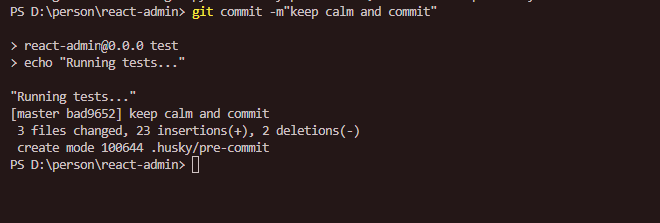
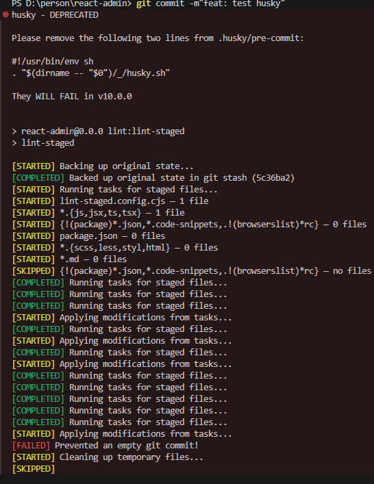
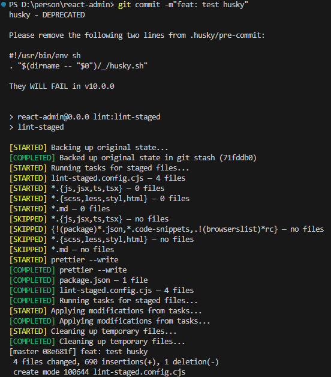
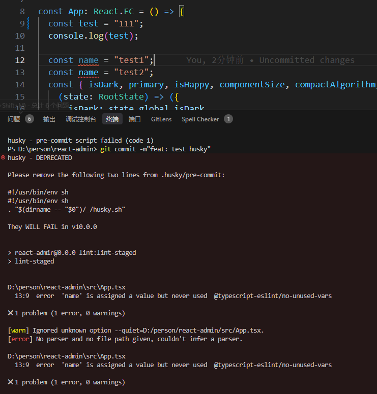

# （八）：提交规范

## Husky - Git Hooks

Husky 在提交或推送时，自动化 检查提交信息、检查代码 和 运行测试。


### 依赖安装

```bash
# 安装依赖
npm install --save-dev husky

# 初始化 husky
npx husky init
```

init 命令后会生成 `.husky` 目录，里面包含 pre-commit 文件，并更新 package.json 的 prepare 脚本。

```bash
# .husky/pre-commit 文件内容
npm test
```

当我们执行 `git commit` 时，会触发 pre-commit 钩子，执行 `npm test` 命令。现在让我们来配置 `npm test` 命令。

```bash
# package.json 的 scripts 配置
"scripts": {
  "prepare": "husky",
  "test": "echo \"Running tests...\""
}
```

这一段表示 npm test 命令会打印内容 `echo "Running tests..."`。



如图所示，到这里我们的 husky 基础配置就完成了。

## lint-staged

lint-staged 对 git 暂存区的文件进行检查。

### 依赖安装

```bash
npm install --save-dev lint-staged
```

### 创建配置文件

在项目根目录创建 `lint-staged.config.js` 文件，并添加以下内容：

```js
// lint-staged.config.js
module.exports = {
  "*.{js,jsx,ts,tsx}": ["eslint --fix", "prettier --write"],
  "{!(package)*.json,*.code-snippets,.!(browserslist)*rc}": ["prettier --write--parser json"],
  "package.json": ["prettier --write"],
  "*.{scss,less,styl,html}": ["stylelint --fix", "prettier --write"],
  "*.md": ["prettier --write"]
};
```

### 修改 hook

修改 `.husky/pre-commit` 文件，添加以下内容：

```bash
#!/usr/bin/env sh
# 初始化脚本
. "$(dirname -- "$0")/_/husky.sh"

npm run lint:lint-staged
```

```bash
npx husky add .husky/pre-commit "npm run lint:lint-staged"
```
这里需要注意， `husky add` 命令已经被废除了，所以需要手动添加，运行上面的命令会报错。

### 添加脚本

在 package.json 的 scripts 中添加以下内容：

```json
// package.json
"scripts": {
  "lint-staged": "lint-staged"
}
```

### 测试

因为上一篇设置 vscode 保存时自动格式化，所以我们需要暂时关闭一下设置。

然后随便写一个不符合规范的代码，看是否能触发 husky 的钩子。

提交失败如图一所示，提交成功如图二所示。

```json
// .vscode/settings.json
{
  "editor.formatOnSave": false
}
```






### 进阶

按照上文的图片，我们发现提交失败后，并没有提示我们哪里不符合规范。

所以我们可以使用 `lint-staged` 的 `staged` 配置，来尝试自动修复可以修复的问题，如果不能修复，则提示我们哪里不符合规范。
创建 `lint-staged.config.mjs` 文件，并添加以下内容：

```js
// lint-staged.config.mjs
import { execaSync } from 'execa';
export default {
  "src/**/*.{js,jsx,ts,tsx}": (files) => {
    try {
      // 执行自动修复
      execaSync('eslint', ['--fix', '--quiet', ...files], { 
        stdio: 'inherit',
        reject: false
      });
      // 执行格式化
      execaSync('prettier', ['--write', '--quiet', ...files], { 
        stdio: 'inherit',
        reject: false
      });
      // 只在最后检查时显示错误
      const result = execaSync('eslint', ['--format', 'stylish', ...files], { 
        stdio: 'inherit',
        reject: false
      });
      if (result.exitCode !== 0) {
        return false;
      }
      return true;
    } catch (error) {
      return false;
    }
  }
};
```


现在让我们写一个不符合规范但可以自动修复的代码和不符合规范但不可以自动修复的代码。然后使用 `git commit` 提交，看是否能自动修复。

```tsx
const App: React.FC = () => {
  var test = "111";
  console.log(test);

  const name = "test1";
  const name = "test2";
  return <div>App</div>;
};
```



跟我们预想的一样，可以自动修复的代码`var test = "111";`修复了，不可以自动修复的代码`const name = "test1"; const name = "test2";`没有修复。

## Commitlint

Commitlint 检查提交信息是否符合规范。

## CZG

Commitizen 提供交互式命令行工具，可以让我们更方便地提交代码。


代码提交流程：

1. 执行 git commit 时
2. Husky 触发 pre-commit hook
3. lint-staged 检查暂存区的文件
4. Commitlint 检查提交信息

交互式流程：

1. 执行 npm run commit
2. Commitizen 提供交互式界面
3. 生成符合 Commitlint 规范的提交信息
4. 触发与普通提交相同的检测流程


## 参考

- [Husky](https://typicode.github.io/husky/zh/)
- [lint-staged](https://www.npmjs.com/package/lint-staged)
