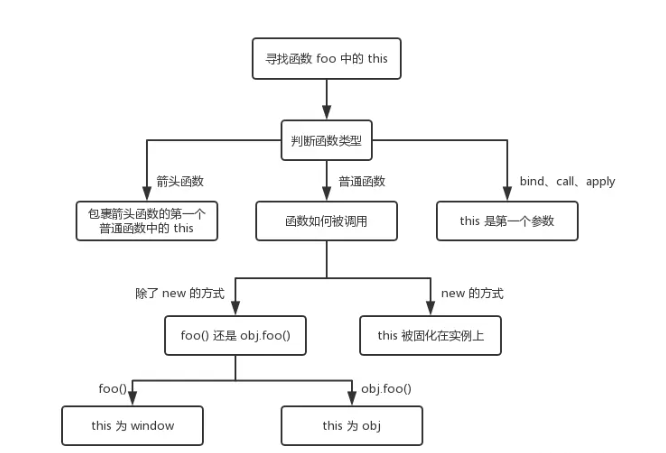

# JavaScript 基础题 - 函数

## 1. 函数定义

```js
// 1.函数声明
function foo(){}
// 存在函数提升问题
foo     undefined
foo()   foo(){}
function foo(){}

// 2.函数表达式
const foo = function(){}
  // 2.1匿名函数
  const myFunction = function(){}
  // 2.2定时时为函数命名
  const myFunction = function nameFunction(){}
  // 2.3IIFF立即执行函数，是函数声明后立即调用的函数表达式
  (function(){
    console.log('-')
  })
// 函数表达式不会升级，所以不能在定义之前调用
foo    undefined
foo()  TypeError
const foo = function(){}

// 3.箭头函数表达式
const foo => () {}

// 4.Function构造函数
const foo = new Function()
```

## 2. 函数参数

形参：在定义函数时使用的参数称为形式参数，形参是函数定义时的占位符，用来接收调用函数时传递的实际参数的值。

实参：在调用函数时传递给函数的参数称为实际参数，实参是实际传递给函数的值，它们会被赋值给对应的形参。如果实参是一个对象引用，则对应形参会和该实参指向同一个对象。

```javascript
function example(a, b, c) {  // 形参 a, b, c
  console.log(a, b, c);
}

example(1, 2);      // 1 2 undefined - 少传参数，缺少的参数为 undefined
example(1, 2, 3, 4); // 1 2 3 - 多余的参数被忽略（但可以通过 arguments 访问）
```

## 3. 闭包

闭包是指在 JavaScript 中，内部函数可以访问外部函数作用域中的变量和参数，即使外部函数已经执行完毕，内部函数仍然可以访问外部函数的变量。

闭包可以帮助我们在函数内部创建私有变量，并且可以访问和修改外部函数的变量，提供了一种封装数据和隐藏实现细节的机制。

使用闭包有以下几大好处：创建私有变量；变量长期驻扎在内存中；避免全局变量的污染。

缺点：占用更多内存，不容易被释放，容易造成内存泄漏

```javascript
function outer() {
  let a = 1
  return () => {
    console.log(a)
  }
}
```

## 4. This 对象

This 是执行上下文中的一个属性，它指向最后一次调用这个方法的对象。



1. 直接调用模式，当作为函数调用时，this 指向全局对象 window
2. 方法调用模式，当函数作为一个对象的方法调用时，谁调用就指向谁
3. 构造器调用模式，当函数用 new 的方式时，this 指向于这个新创建的对象
4. apply、call、bind 调用模式
5. 箭头函数调用模式，this指向包裹箭头函数的第一个函数对象的this

## 5. 原型和原型链

### 定义

原型：在js 中我们是使用构造函数来新建一个对象的，每一个构造函数的内部都有一个 prototype 属性值，这个属性值是一个对象，这个对象包含了可以由该构造函数的所有实例共享的属性和方法。当我们使用构造函数新建一个对象后，在这个对象的内部将包含一个指针，这个指针指向构造函数的 prototype 属性对应的值，在 ES5 中这个指针被称为对象的原型。

原型链：原型链就是多个对象通过 __proto__ 的方式连接了起来。当我们访问一个对象的属性时，如果这个对象内部不存在这个属性，那么它就会去它的原型对象里找这个属性，这个原型对象又会有自己的原型，于是就这样一直找下去，也就是原型链的概念。
JavaScript只有一种结构：对象。每个对象（object）都有一个私有属性指向另一个名为原型（prototype）的对象。原型对象也有一个自己的原型，层层向上直到一个对象的原型为null。null没有原型，并作为这个原型链中的最后一个环节。

### 总结

原型：每个函数都有一个 prototype 属性，这个属性指向函数的原型对象。

原型链：每个对象都有一个 __proto__ 属性，这个属性指向对象的原型。__proto__ 将对象和原型连接起来组成了原型链。

### 常见属性和方法

- `Object.getPrototypeOf(obj)`：获取对象的原型（推荐使用）
- `Object.setPrototypeOf(obj, prototype)`：设置对象的原型（影响性能）
- `Object.create(prototype)`：创建以指定原型为原型的新对象
- `obj.hasOwnProperty(prop)`：检查属性是否为对象自身所有


## 6. 继承

### 6.1 原型链继承
### 6.2 构造函数继承
### 6.3 组合继承
### 6.4 原型式继承
### 6.5 寄生式继承
### 6.6 寄生组合式继承
### 6.7 class继承
