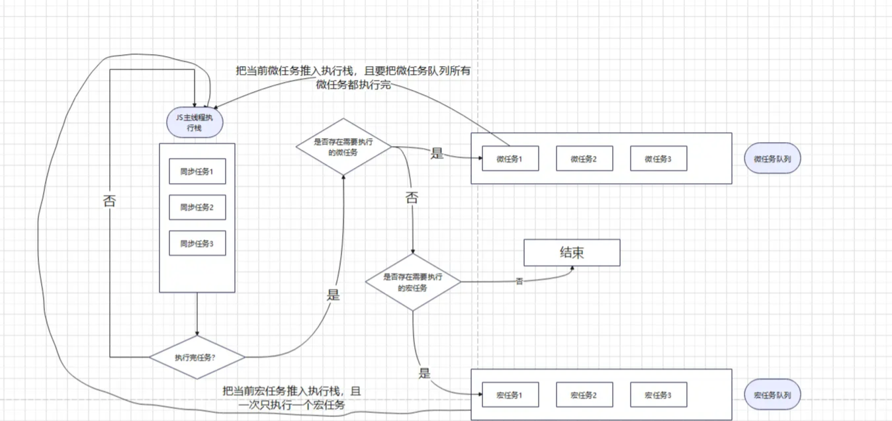

# 异步

## 定时器

### setTimeout

setTimeOut 函数在指定时间后执行一次回调函数。

```js
setTimeout(() => {
  console.log('setTimeout');
}, 1000);
```

### setInterval

setInterval 函数在指定时间间隔后重复执行回调函数。

```js
setInterval(() => {
  console.log('setInterval');
}, 1000);
```

### requestAnimationFrame

requestAnimationFrame 函数在下一帧渲染开始前执行回调函数。自带函数节流功能，基本可以保证在 60 帧/秒的渲染频率下执行回调函数。

```js
requestAnimationFrame(() => {
  console.log('requestAnimationFrame');
});
```

### setTimeOut 和 setInterval 的时间精确性问题

#### 原因

1. JavaScript 单线程问题，即使指定时间执行，如果主线程还在执行其他任务，由于线程阻塞问题，也会延迟执行。

```js
console.log('开始');
setTimeout(() => {
  console.log('定时器');
}, 1000);
// 执行一个耗时操作
for(let i = 0; i < 1000000000; i++) {}
console.log('结束');

// 输出顺序：
// 开始
// 结束
// 定时器（可能会远超1000ms）
```

2. 事件循环机制，定时器属于宏任务，每次事件循环都会先执行微任务，再执行宏任务，即使设置延迟为0，也会在下一轮事件循环中执行。

```js
setTimeout(() => {
  console.log('定时器1');
}, 0);

Promise.resolve().then(() => {
  console.log('Promise');
});

console.log('主线程');

// 输出顺序：
// 主线程
// Promise
// 定时器1
```

3. 最小延迟时间限制，浏览器对最小延迟时间有限制，setTimeout 最小延迟时间限制为 4ms，setInterval 最小延迟时间限制为 10ms。

4. 系统时间精度问题，系统时间可能存在误差，导致定时器执行时间不准确。

5. setInterval 回调堆积问题，如果回调执行时间超过间隔时间，会导致回调堆积，影响性能。

```js
// 可能导致回调堆积的情况
setInterval(() => {
  // 执行一个耗时操作
  for(let i = 0; i < 1000000000; i++) {}
  console.log('执行');
}, 1000);
```

#### 解决方案

1. 使用 requestAnimationFrame 代替 setTimeout 和 setInterval，可以保证在 60 帧/秒的渲染频率下执行回调函数。
2. Web Worker 不受主线程阻塞影响，可以独立执行。


## Promise

Promise 对象是一个构造函数，内部的代码是同步执行的，用来生成 Promise 实例。

Promise构造函数接受一个函数作为参数，该函数的两个参数分别为resolve reject。

```js
const promise = new Promise((resolve, reject) => {
  if (/* 异步操作成功 */) {
    resolve('success');
  } else {
    reject('error');
  }
});
```

Promise 对象有两个特点：

- 对象的状态不受外界影响。
- 一旦状态改变，就不会再变，任何时候都可以得到这个结果。

Promise 对象有三种状态：

- pending：初始状态，既不是成功，也不是失败。
- fulfilled：成功状态。
- rejected：失败状态。

Promise 的优点：

- 解决了地狱回调问题

Promise 的缺点：

- 无法取消 Promise，一旦新建它就会立即执行，无法中途取消
- 如果不设置回调函数，则无法捕获 Promise 内部抛出的错误
- 当处于 pending 状态时，无法得知进展到哪一个阶段

**Promise 对象的方法：**

1. then

then 方法是添加状态改变时的回调函数。then 方法返回的是一个新的 Promise 实例。
then 方法可以接受两个回调函数作为参数，第一个是resolved状态的回调函数，第二个是rejected状态的回调函数。

```js
promise.then(function(value){
  //	success
},function(error){
  //	fail
});
```

2. catch

catch 方法用于指定发生错误时的回调函数。

```js
promise.catch(function(error){
  //	fail
});
```

3. finally

finally 方法用于指定不管 Promise 对象最后状态如何，都会执行的操作。

```js
promise.finally(function(){
  //	finally
});
```

4. all

all 方法用于将多个 Promise 实例，包装成一个新的 Promise 实例。

当所有的 Promise 实例都变为 fulfilled 状态时，Promise.all 返回一个新的 Promise 实例，该实例的状态为 fulfilled，并且返回值是一个由所有 Promise 实例的返回值组成的数组。

当任何一个 Promise 实例变为 rejected 状态时，Promise.all 返回的 Promise 实例的状态为 rejected，并且返回值是第一个被拒绝的 Promise 的返回值。

**特点**

- 所有 Promise 都成功，返回一个包含所以结果的数组
- 任何一个 Promise 失败，返回的 Promise 实例状态为 rejected，并且返回值是第一个被拒绝的 Promise 的返回值

**适用场景**

当需要等待多个异步操作都完成后才执行后续操作时，比如同时请求多个接口数据，然后等待所有数据都返回后再进行页面渲染。

```js
const p = Promise.all([p1, p2, p3]);
```

5. race

race 方法用于将多个 Promise 实例，包装成一个新的 Promise 实例。

当 Promise 实例中有一个率先改变状态（fulfilled 或 rejected）时，Promise.race 返回的 Promise 实例就会改变状态，和第一个改变状态的 Promise 的状态保持一致，并返回该 Promise 的返回值。

**特点**

- 返回最先解决或拒绝的Promise的结果或原因

**适用场景**

当需要只取决于最快完成的异步操作的结果时，比如设置一个超时时间，只要有一个请求在规定时间内返回结果，就不再等待其他请求。

```js
const p = Promise.race([p1, p2, p3]);
```

6. allSettled

allSettled 方法用于将多个 Promise 实例，包装成一个新的 Promise 实例。

等待所有 Promise 实例都返回结果，不管是 fulfilled 还是 rejected，返回一个新的 Promise 实例。

返回的 Promise 实例在所有 Promise 实例都完成后才变为 fulfilled 状态，返回值是一个由所有 Promise 实例的结果组成的数组，每个结果是一个对象，包含状态（fulfilled 或 rejected）和值。

**特点**

- 无论每个 Promise 是成功还是失败，都会返回每个 Promise 的结果

**适用场景**

当你需要知道所有异步操作的最终结果，无论它们是成功还是失败。

```js
const p = Promise.allSettled([p1, p2, p3]);
```

7. any

any 方法用于将多个 Promise 实例，包装成一个新的 Promise 实例。

当其中一个 Promise 实例变为 fulfilled 状态时，Promise.any 返回一个新的 Promise 实例，该实例的状态为 fulfilled，并且返回值是第一个成功的 Promise 的返回值。

当所有 Promise 实例都变为 rejected 状态时，Promise.any 返回的 Promise 实例的状态为 rejected，并且抛出一个 AggregateError 实例，其中包含所有 Promise 实例的拒因。

**特点**

- 返回第一个成功的Promise的值
- 所有Promise都被拒绝，返回一个AggregateError，包含所有的拒绝原因

**适用场景**

当需要等待多个异步操作中的任意一个成功时，即可执行后续操作，比如多个备用接口，只要有一个接口返回了有效数据就不再等待其他接口。

```js
const p = Promise.any([p1, p2, p3]);
```

**总结：**

all,race,allSettled,any 都是 Promise 的静态方法，它们返回的都是一个新的 Promise 实例。

**all()和allSettled()对比：**

有多个不依赖于彼此成功完成的异步任务时，或者想知道每个 Promise 的结果时，使用 allSettled()

任务相互依赖，或者想在任何 Promise 被拒绝时立即拒绝则用 all()

**race()和any()对比**

如果需要最快的异步操作成功，使用 race()

如果需要任意一个异步操作成功，使用 any()

**allSettled()和any()对比**

如果需要知道所有异步操作的最终结果，使用 allSettled()

如果需要任意一个异步操作成功，使用 any()

## 手写 Promise

## async/await

async/await 是 ES7 引入的用于处理异步操作的语法糖，它可以让异步代码看起来更像同步代码，从而提高代码的可读性和可维护性。

async关键字用于声明一个函数是异步的，总是返回一个Promise.

await关键字用于等待一个Promise完成，只能在async函数内部使用，返回可以是一个Promise对象，也可以是对应的值。

```js
async function fetchData() {
  const response = await fetch('https://api.example.com/data');
  const data = await response.json();
  return data;
}
```

## 线程和进程

进程是操作系统分配资源的基本单位，每个进程都有独立的内存空间。

线程是操作系统调度的最小单位，一个进程可以包含多个线程，线程共享进程的内存空间。

## 单线程

单线程是指一个计算机程序在执行时只使用一个线程来处理任务。

JavaScript 是单线程的，也就是说，同一时间只能执行一个任务，其他任务必须在后面排队等待。

JavaScript 主要用途是用户交互以及操作 DOM。多线程操作 DOM，可能出现操作的冲突（例如一个操作节点，一个删除节点）。没有锁的概念。

## Event Loop 事件循环

Event Loop 是 JavaScript 的执行机制，它是一个循环，不断地检查事件队列中是否有事件需要执行。



### 执行栈

JavaScript运行的时候，会形成一个执行栈。执行栈是一个LIFO（后进先出）的数据结构，用于存储代码执行期间创建的所以执行上下文。

当调用一个函数，就会将该函数的执行上下文压入执行栈并开始执行；

正在执行的函数如果调用了其他函数，就会将其他函数的执行上下文压入执行栈并开始执行；

当函数执行完毕，就会将该函数的执行上下文从执行栈中弹出。

```js
function a() {
  console.log('a');
}

function b() {
  console.log('b');
  a();
}

/**
 * 输出结果：
 * b
 * a
 */
```

**执行顺序：**
1. 调用函数b，将b的执行上下文压入执行栈；
2. 执行函数b，输出b；
3. 执行函数a，将a的执行上下文压入执行栈；
4. 执行函数a，输出a；
5. 函数a执行完毕，将a的执行上下文从执行栈中弹出；
6. 函数b执行完毕，将b的执行上下文从执行栈中弹出；

### 同步任务和异步任务

JavaScript将所有执行任务分为同步任务和异步任务。

同步任务的执行顺序会按照代码顺序和调用顺序压入执行栈中执行；

异步任务的执行顺序也会压入执行中执行，但是异步任务会放入到一个任务队列中，等待执行栈中的同步任务执行完毕后，才会从任务队列中读取任务并压入执行栈中执行。

### 任务队列

任务队列是一个FIFO（先进先出）的数据结构，用于存储待执行的任务。

任务队列分为宏任务队列（Macrotask）和微任务队列（Microtask）。宏任务和微任务的区别，就是它们的执行顺序不同。

**宏任务：**

- script 脚本
- setTimeout
- setInterval
- setImmediate
- I/O
- UI rendering

```js
setTimeout(() => {
  	console.log('a');
}, 10000);

setTimeout(() => {
  	console.log('b');
}, 100);
requestAnimationFrame(() => {
    console.log('c');
})

/**
 * 输出结果：
 * c
 * b
 * a
 */
```

**执行顺序**

1. 初始状态： 执行栈为空，宏任务队列为空，微任务队列为空；`(整体代码script压入宏任务队列)`

2. 调用 setTimeout1，将 setTimeout1 的执行上下文压入执行栈，并开始执行，将回调函数压入宏任务队列中，执行完毕，将其从执行栈中弹出；

3. 调用 setTimeout2，将 setTimeout2 的执行上下文压入执行栈，并开始执行，将回调函数压入宏任务队列中，执行完毕，将其从执行栈中弹出；

4. 调用 requestAnimationFrame，将 requestAnimationFrame 的执行上下文压入执行栈，并开始执行，将回调函数压入宏任务队列中，执行完毕，将其从执行栈中弹出；`(script宏任务执行结束，推出宏任务队列)`

5. 等待约 16.7ms，requestAnimationFrame 的回调函数入栈，并开始执行，输出 c，执行完毕，将其从宏任务队列中弹出；

6. 等待约 83.3ms，setTimeout2 的回调函数入栈，并开始执行，输出 b，执行完毕，将其从宏任务队列中弹出；

7. 等待约 9900ms，setTimeout1 的回调函数入栈，并开始执行，输出 a，执行完毕，将其从宏任务队列中弹出。

**微任务：**

- process.nextTick
- Promise.then catch finally
- MutationObserver

```js
Promise.resolve()
  .then(() => {
      console.log('promise1');
      // 在微任务中创建的微任务会在当前循环中执行
      Promise.resolve().then(() => {
          console.log('promise2');
      });
  })
  .then(() => {
      console.log('promise3');
  });
/**
 * 输出结果：
 * promise1
 * promise2
 * promise3
 */
```

**执行顺序**

1. 初始状态： 执行栈为空，宏任务队列为空，微任务队列为空；`(宏任务队列：[script]，微任务队列：[])`

2. 调用 Promise.resolve，将 Promise.resolve 的执行上下文压入执行栈，并开始执行，将第一个then压入微任务队列中，执行完毕，将其从执行栈中弹出；`(微任务队列：[then1])`

3. 调用 第一个 Promise.then，将 Promise.then 的执行上下文压入执行栈，并开始执行，输出 promise1，将第二个then压入微任务队列中，内部的 Promise.resolve().then() 创建新的微任务，执行完毕，将其从执行栈中弹出；`(微任务队列：[Promise.resolve().then()，then2])`

4. 调用 第二个 Promise.then，将 Promise.then 的执行上下文压入执行栈，并开始执行，输出 promise3，执行完毕，将其从执行栈中弹出；`(微任务队列：[Promise.resolve().then()])`

5. 调用 Promise.resolve().then()，将 Promise.resolve().then() 的执行上下文压入执行栈，并开始执行，输出 promise2，执行完毕，将其从执行栈中弹出。`(微任务队列：[])`


### Event Loop 执行顺序

宏任务和微任务的执行，就是事件循坏的一部分。

**执行顺序：**

1. 从宏任务队列中，按照入队顺序，找到第一个执行的宏任务，放入调用栈，开始执行；

2. 执行完该宏任务下所有同步任务后，即调用栈清空后，该宏任务被推出宏任务队列，然后微任务队列开始按照入队顺序，依次执行其中的微任务，直至微任务队列清空为止；

3. 当微任务队列清空后，一个事件循环结束；

4. 接着从宏任务队列中，找到下一个执行的宏任务，开始第二个事件循环，直至宏任务队列清空为止。

**注意点**

- 当执行代码时，会将整体代码`script`放入宏任务队列中，然后开始执行；因此事件循坏是从第一个宏任务开始；

- 如果在执行微任务时，又创建了微任务，那么会继续执行微任务，直到微任务队列清空为止。


### 总结

 JavaScript 是单线程运行的，在代码执行的时候，通过将不同函数的执行上下文压入执行栈中来保证代码的有序执行。在执行同步代码的时候，如果遇到了异步事件，并不会一直等待结果，而是会将这个事件挂起并加入到相应的队列中区间，继续执行执行栈中的其他任务。当同步事件执行完毕后，再将异步事件对应的回调加入到与当前执行栈中不同的另一个任务队列中等待执行。任务队列可以分为宏任务队列和微任务队列，当当前执行栈中的事件执行完毕后，js 引擎首先会判断微任务队列中是否有任务可以执行，如果有就将微任务队首的事件压入栈中执行。当微任务队列中的任务都执行完成后再去判断宏任务对列中的任务。

