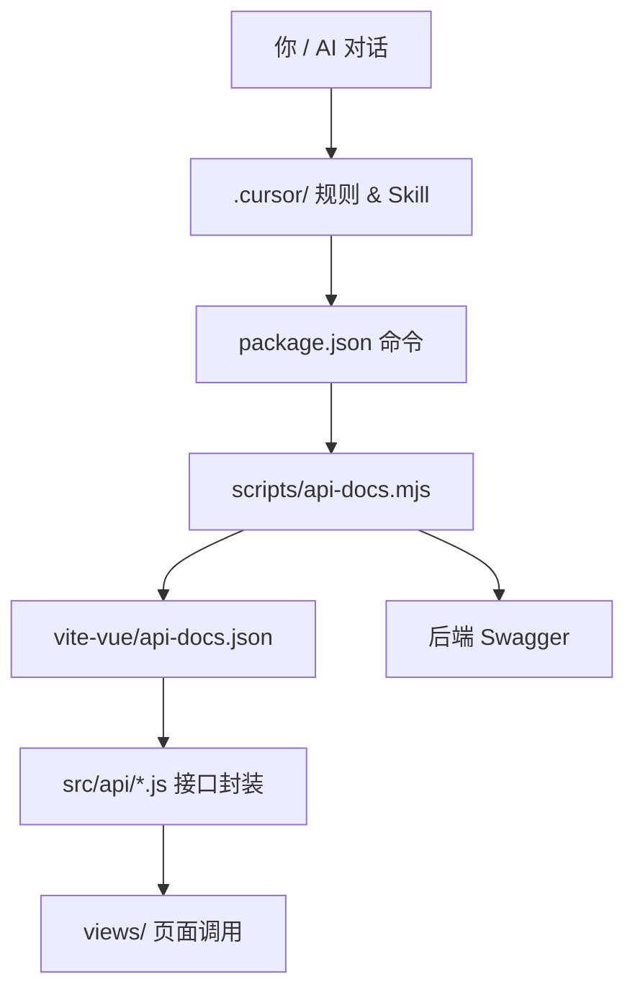

# api-docs

在使用 Cursor 编码时，看到 AI 在终端使用 Python 跑的小脚本，用来读取我给的 API 文档，并保存到本地。

这个是临时命令，无法持久化，于是产生了自己写一个 Skill 的想法，用来读取 API 文档。

## 自执行的脚本命令

既然想赋予AI执行能力，所以需要选一种脚本语言。

| 方式 | 同步 | 查询 | 优点 | 缺点 |
| --- | --- | --- | --- | --- |
| Shell + curl | `curl -o api-docs.json "http://.../v2/api-docs?group=H5接口"` | 自己写 `grep` / `jq` | 同步简单，零依赖 | 查询脚本难维护 |
| Python 脚本 | `python scripts/api-docs.py sync` | `python scripts/api-docs.py query eid` | 解析 JSON 方便 | 要多维护 Python 环境 |
| Makefile | `make api-docs-sync` | `make api-docs-query eid=xxx` | 命令短、可组合 | Windows 支持一般 |
| pnpm / yarn 脚本 | `pnpm api-docs:sync` | `pnpm api-docs:query eid` | 和 npm 一样，团队熟悉 | 本质仍是调某个脚本 |
| 直接读文件 | sync 仍要手动或脚本拉 | AI 用 Grep / Read 搜 `api-docs.json` | 查询不用跑命令 | sync 仍需手动 |

对于 AI 来说，重要的是统一入口，使用哪种底层语言并不重要。

原本想使用 Python 脚本，但考虑到项目里已使用 Node，就选择了 npm 脚本。

## 整体设计

整体是 4 层，从上到下是「谁指导谁，谁调用谁」。

| 层级 | 文件 | 作用 | 会不会真正执行 |
| --- | --- | --- | --- |
| ① 指导层 | `.cursor/rules/api-docs.mdc` | 每次对话告诉 AI：接口相关要先查文档 | ❌ 只是规则 |
| ① 指导层 | `.cursor/skills/api-docs/SKILL.md` | 更细的工作流：何时 query / sync | ❌ 只是 Skill |
| ② 入口层 | `package.json` 的 scripts | 给人和 AI 用的统一命令入口 | ✅ 你跑 npm 时执行 |
| ③ 执行层 | `scripts/api-docs.mjs` | 真正读/写文档的逻辑 | ✅ node 执行 |
| ④ 数据层 | `api-docs.json` | 本地 Swagger 快照 | 被读写 |



## Cursor 的配置

因为是使用 Cursor 编辑器，所以需要配置 Cursor 的规则和 Skill。

### Cursor规则

`.cursor/rules/api-docs.mdc` 在 `alwaysApply: true` 时每次对话都会带上这条规则；若觉得上下文过长，可改为 `alwaysApply: false`（见文末「优化」一节）。

````md
---
description: 接口开发前先查阅 api-docs.json
alwaysApply: true
---

# API 文档优先

文档位置：`api-docs.json`（Swagger 2.0，本地维护，已 gitignore）

涉及接口时，**使用项目命令操作文档**，不要手写 python 临时脚本。

## 命令

在项目根目录（vite-vue）执行：

```bash
# 查询接口/模型（改代码前）
npm run api-docs:query -- /h5/eid/lottery
npm run api-docs:query -- ZaishengHomeVo

# 拉取最新文档（文档过期时）
npm run api-docs:sync
```

## 何时 query（读文档）

- 新增/修改 `src/api/` 接口封装
- 对接页面字段、枚举值、返回值结构
- 用户询问接口参数或返回含义
- 代码行为与预期不符，需要核对

## 何时 sync（更新文档）

- 用户要求更新/同步 api 文档
- 文档里搜不到接口或字段，怀疑后端已变更
- 联调报错且本地文档可能过期
- 本地缺少 `api-docs.json`

**流程：** 需要更新时先 `sync`，再 `query`，最后改代码。

## 相关路径

- 文档：`api-docs.json`
- 脚本：`scripts/api-docs.mjs`
- 封装：`src/api/`
- 页面：`src/views/`
````

### Cursor Skill

`.cursor/skills/api-docs/SKILL.md` 描述更细的工作流，AI 遇到接口相关任务时会按 Skill 执行，也可以手动 `@` 引用 Skill。

````md
---
name: api-docs
description: 查询或同步 api-docs.json。涉及 H5 接口路径、参数、返回字段时使用；后端发版或文档过期时使用 sync。
---

# API 文档工作流

文档路径：`api-docs.json`（本地维护，已 gitignore）

## 何时查询（query）

在以下场景**先执行查询命令**，再写/改代码：

- 新增或修改 `src/api/` 接口封装
- 对接页面字段（如 `propNum`、任务状态、抽奖 `type`）
- 用户问「这个接口怎么传参 / 返回什么」
- 现有代码与接口行为不一致，需要核对文档

```bash
npm run api-docs:query -- /h5/eid/lottery
npm run api-docs:query -- ZaishengHomeVo
npm run api-docs:query -- eid
```

## 何时更新（sync）

在以下场景**先同步文档**，再 query：

- 用户明确要求「更新 api 文档 / 拉最新 swagger」
- 后端刚发版，或文档里搜不到新接口/新字段
- 接口联调报错，怀疑本地文档过期
- 首次 clone 项目且本地没有 `api-docs.json`

```bash
npm run api-docs:sync
```

可选环境变量：

```bash
API_DOCS_URL=http://your-host:8089/v2/api-docs?group=H5接口 npm run api-docs:sync
```

## AI 对话集成方式

| 用户意图 | AI 应执行 |
|---------|-----------|
| 「查一下 xxx 接口」 | `npm run api-docs:query -- xxx` |
| 「更新文档 / 同步 swagger」 | `npm run api-docs:sync`，必要时再 query |
| 「对接/改 xxx 活动接口」 | 先 query 相关 path/model，再改 `src/api` 和页面 |
| 字段含义不确定 | query 对应 Vo，不要猜测 |

## 优先级

1. 以 `api-docs.json` 为准
2. 文档与 `src/api/*.js` 不一致时，更新封装代码
3. 文档明显过期时，先 `sync` 再 `query`
````

## 脚本编写

`scripts/api-docs.mjs` 是真正读/写文档的逻辑，使用`node`执行。

这个脚本主要会去读取`api-docs.json`文件，如果文件不存在，则会提示用户先执行`npm run api-docs:sync`命令。

````javascript
#!/usr/bin/env node
import { readFileSync, writeFileSync } from 'node:fs'
import { dirname, join } from 'node:path'
import { fileURLToPath } from 'node:url'

const __dirname = dirname(fileURLToPath(import.meta.url))
const DOCS_PATH = join(__dirname, '../api-docs.json')
const DEFAULT_SYNC_URL = '具体地址'

const usage = `
用法:
  npm run api-docs:sync              从后端拉取最新 Swagger 文档
  npm run api-docs:query -- <关键词>  查询接口路径或数据模型

示例:
  npm run api-docs:query -- /h5/eid/lottery
  npm run api-docs:query -- ZaishengHomeVo
  npm run api-docs:query -- eid

环境变量:
  API_DOCS_URL   同步地址，默认 ${DEFAULT_SYNC_URL}
`.trim()

function loadDocs() {
  try {
    return JSON.parse(readFileSync(DOCS_PATH, 'utf8'))
  } catch {
    console.error(`未找到文档: ${DOCS_PATH}`)
    console.error('请先执行: npm run api-docs:sync')
    process.exit(1)
  }
}

function printPath(path, method, detail) {
  console.log(`\n[${method.toUpperCase()}] ${path}`)
  if (detail.summary) console.log(`  摘要: ${detail.summary}`)
  if (detail.description) console.log(`  说明: ${detail.description}`)
  if (detail.parameters?.length) {
    console.log('  参数:')
    detail.parameters.forEach((p) => {
      console.log(`    - ${p.name} (${p.in})${p.required ? ' *必填' : ''}: ${p.description || p.type || ''}`)
    })
  }
  const schema = detail.responses?.['200']?.schema?.$ref
  if (schema) console.log(`  返回: ${schema.replace('#/definitions/', '')}`)
}

function printDefinition(name, detail) {
  console.log(`\n[Model] ${name}`)
  if (detail.description) console.log(`  说明: ${detail.description}`)
  if (!detail.properties) return
  console.log('  字段:')
  Object.entries(detail.properties).forEach(([key, value]) => {
    const ref = value.$ref ? ` -> ${value.$ref.replace('#/definitions/', '')}` : ''
    const type = value.type || value.format || (value.items?.$ref ? `array<${value.items.$ref.replace('#/definitions/', '')}>` : '')
    console.log(`    - ${key}: ${type}${ref}${value.description ? ` (${value.description})` : ''}`)
  })
}

async function syncDocs() {
  const url = process.env.API_DOCS_URL || DEFAULT_SYNC_URL
  console.log(`正在同步: ${url}`)

  const res = await fetch(url)
  if (!res.ok) {
    console.error(`同步失败: HTTP ${res.status}`)
    process.exit(1)
  }

  const data = await res.json()
  writeFileSync(DOCS_PATH, `${JSON.stringify(data)}\n`, 'utf8')

  const pathCount = Object.keys(data.paths || {}).length
  const modelCount = Object.keys(data.definitions || {}).length
  console.log(`已更新 ${DOCS_PATH}`)
  console.log(`接口 ${pathCount} 个，模型 ${modelCount} 个`)
}

function queryDocs(keyword) {
  const docs = loadDocs()
  const key = keyword.toLowerCase()
  const paths = Object.entries(docs.paths || {}).filter(([path]) => path.toLowerCase().includes(key))
  const models = Object.entries(docs.definitions || {}).filter(([name]) => name.toLowerCase().includes(key))

  if (!paths.length && !models.length) {
    console.log(`未找到与 "${keyword}" 相关的内容`)
    console.log('可尝试: npm run api-docs:sync 更新文档后再查')
    process.exit(1)
  }

  console.log(`查询 "${keyword}" 的结果:`)

  paths.forEach(([path, methods]) => {
    Object.entries(methods).forEach(([method, detail]) => {
      if (typeof detail === 'object') printPath(path, method, detail)
    })
  })

  models.forEach(([name, detail]) => printDefinition(name, detail))
}

const [command, ...args] = process.argv.slice(2)

if (!command || command === 'help' || command === '-h' || command === '--help') {
  console.log(usage)
  process.exit(0)
}

if (command === 'sync') {
  syncDocs().catch((err) => {
    console.error(`同步失败: ${err.message}`)
    process.exit(1)
  })
} else if (command === 'query') {
  const keyword = args.join(' ').trim()
  if (!keyword) {
    console.error('请提供查询关键词，例如: npm run api-docs:query -- /h5/eid/lottery')
    process.exit(1)
  }
  queryDocs(keyword)
} else {
  queryDocs(command)
}

````

## 文档位置

`api-docs.json` 是本地维护的 Swagger 快照，供脚本读写，这里不过多介绍。

## package.json 入口

我们完成了脚本的编写，以及 rule 和 Skill 的配置，最后需要一个入口供 AI 和用户调用。

`package.json`的`scripts`字段中添加了两个命令：

```json
"scripts": {
  "api-docs:sync": "node scripts/api-docs.mjs sync",
  "api-docs:query": "node scripts/api-docs.mjs query"
}
```

### 等价关系

```bash
npm run api-docs:sync
  └─> node vite-vue/scripts/api-docs.mjs sync
        └─> fetch 后端 → 写入 vite-vue/api-docs.json

npm run api-docs:query -- christmas
  └─> node vite-vue/scripts/api-docs.mjs query christmas
        └─> 读取 vite-vue/api-docs.json → 打印匹配结果
```

这样，用户和 AI 就可以通过 `npm run api-docs:sync` 和 `npm run api-docs:query` 命令来同步和查询文档了。

## 使用

这里分为查接口和更新文档两种场景。

场景A：查接口（如「查宰牲节接口」）

```mermaid
你提问
  → AI 读到 .cursor 规则/Skill
  → AI 跑 npm run api-docs:query -- eid
  → api-docs.mjs 读本地 api-docs.json
  → 输出接口信息
  → AI 根据结果回答 / 写 src/api/
```

场景B：更新文档（如「更新文档」）

```mermaid
你提问
  → AI 读到规则：文档过期先 sync
  → AI 跑 npm run api-docs:sync
  → api-docs.mjs 从后端拉 Swagger
  → 覆盖 api-docs.json
  → （可选）再 query 确认
  → 再改代码
```

## 优化

因为上面把规则设置为`alwaysApply: true`，所以每次对话都会带上这条规则。

现在改为按需加载，以减少每次对话的上下文体积：

```md
# 之前
alwaysApply: true

# 现在
alwaysApply: false
description: 当用户提到接口、API、swagger、api-docs、对接、传参...
```

另外也可以通过 `globs` 字段来配置触发方式：当用户编辑 `src/api/**` 下的文件时，自动带上这条规则。

这里的规则配置可以看到官方文档：[Cursor Rules](https://docs.cursor.com/rules)

### Cursor 规则触发方式

| 类型 | 配置 | 行为 |
| --- | --- | --- |
| 始终应用 | `alwaysApply: true` | 每次对话都带（之前的做法） |
| 按需应用 | `alwaysApply: false` + 关键词 `description` | AI 根据你的话判断是否加载 |
| 打开文件触发 | `alwaysApply: false` + `globs: src/api/**` | 编辑 api 文件时自动带上 |
| 手动引用 | 聊天里 `@api-docs.mdc` | 你主动 @ 时一定带上 |