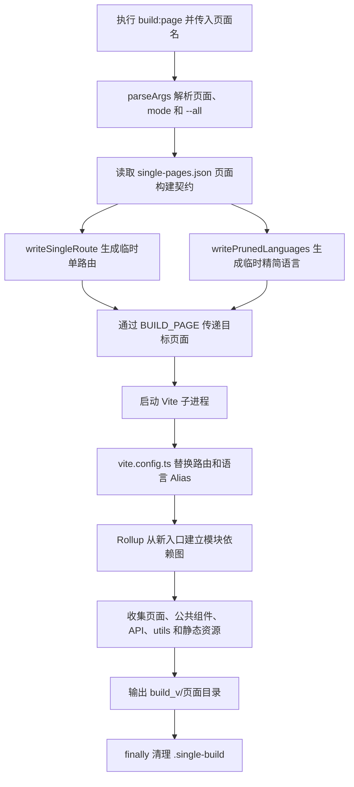

# Vite 单路由独立构建机制

在常规的 Vue/Vite 单页应用中，所有页面通常共享一个 HTML 入口：

```text
build_v/index.html
```

页面通过 Vue Router 的 Hash 路由访问：

```text
build_v/index.html#/weekly-star
build_v/index.html#/weekly-cp
```

项目规模较小时，这种构建方式最简单。但活动页面不断增加以后，所有路由仍然属于同一次应用构建和同一个发布目录。即使页面使用了路由懒加载，Vite 只是把它们拆成不同的 JS Chunk，这些 Chunk 依然是完整构建产物的一部分。

这会带来几个现实问题：

- 修改一个活动页面，通常仍要重新构建和发布整个 SPA。
- 已经稳定的历史活动与新活动共享同一个发布批次，回滚边界不够清晰。
- 完整路由表、页面 Chunk 和语言文件会随着活动数量持续增加。
- 静态资源平台无法只接收某个页面的一套自包含产物。

如果希望某个活动页面可以单独构建、单独发布和单独回滚，同时继续复用原项目中的公共组件、API 和工具方法，就需要把“完整 SPA”之外的另一个构建单位引入项目：单路由独立页面包。

构建完成后，同一个页面可能同时存在两个访问地址：

```text
完整 SPA：
https://res.example.com/build_v/index.html#/weekly-star

独立页面包：
https://res.example.com/build_v/weekly-star/index.html#/weekly-star
```

这两个地址可以展示完全相同的界面，因为它们最终加载的是同一个 `weekly-star` Vue 页面组件。但是，它们的 HTML 入口和加载的构建资源并不相同。

| 对比项      | 完整 SPA 地址        | 独立页面地址                     |
| ----------- | -------------------- | -------------------------------- |
| HTML 入口   | `build_v/index.html` | `build_v/weekly-star/index.html` |
| Hash 路由   | `#/weekly-star`      | `#/weekly-star`                  |
| 路由表      | 完整路由表           | 只包含 `weekly-star`             |
| JS/CSS 资源 | `build_v/assets/`    | `build_v/weekly-star/assets/`    |
| 发布单位    | 整个 SPA             | 当前页面                         |

URL 中 `#` 前后的职责也不同：

```text
https://res.example.com/build_v/weekly-star/index.html#/weekly-star
│                                                     │
└── 服务器实际请求的 HTML 文件                         └── 浏览器端 Vue Router 路由
```

浏览器请求服务器时，不会把 `#/weekly-star` 当成文件路径发送。因此两个地址真正的区别发生在 `#` 前面：一个请求主包的 `index.html`，另一个请求 `weekly-star` 目录下的独立 `index.html`。`#` 后面虽然相同，但它们是在两套不同的前端构建产物中匹配同一个业务路由。

最终目录大致如下：

```text
build_v/
├── index.html                      # 完整 SPA 入口
├── assets/                         # 完整 SPA 资源
└── weekly-star/
    ├── index.html                  # weekly-star 独立入口
    └── assets/                     # weekly-star 自己的构建资源
```

单路由独立构建不是再维护一份 `weekly-star` 项目，也不是把主包复制到子目录。本文讨论的机制是在不拆分原项目、不复制公共源码的前提下，在构建阶段临时替换完整路由和语言入口，让 Vite/Rollup 只构建目标页面及其能够到达的依赖，最后输出一套可以独立部署的页面产物。

## 一、单路由独立构建的本质

单路由独立构建不是把完整构建产物复制到一个子目录，也不只是修改 `outDir`。

它真正改变的是 Vite 构建时看到的模块依赖图。

完整 SPA 的依赖关系大致如下：

```text
main.ts
└── router/index.ts
    └── router/base.ts
        ├── 页面 A
        ├── 页面 B
        ├── 页面 C
        └── 页面 D
```

即使这些页面使用动态 `import()`，Rollup 仍然能从完整路由表中发现它们。动态导入会把页面拆成不同 Chunk，但不会让它们离开本次构建。

单路由构建将路由入口临时替换为：

```text
main.ts
└── router/index.ts
    └── router/base.single.ts
        └── 页面 B
            ├── 公共组件
            ├── API
            ├── utils
            ├── 样式
            └── 图片
```

此时，页面 A、C、D 不再能从入口到达，因此不会进入当前构建；页面 B 引用的公共组件和公共方法仍然可达，所以会正常进入产物。

因此，这套机制的核心不是“按文件夹挑选文件”，而是：

> 通过替换路由入口，改变构建阶段的模块可达性。

## 二、它与其他方案有什么区别

单路由独立构建容易与路由懒加载、Vite 多页面应用和微前端混淆。

| 方案            | 路由表             | HTML 入口    | 发布单位             | 主要目的               |
| --------------- | ------------------ | ------------ | -------------------- | ---------------------- |
| 路由懒加载      | 完整               | 一个         | 整个 SPA             | 降低首屏加载量         |
| Vite 多页面应用 | 多套固定入口       | 多个         | 一次构建中的多个页面 | 构建多个固定站点入口   |
| 微前端          | 各应用独立         | 多个         | 独立应用             | 运行时组合多个应用     |
| 单路由独立构建  | 每次只保留一个路由 | 每个页面一个 | 单个业务页面         | 页面级构建、发布和回滚 |

单路由构建仍然可以复用原项目的 `main.ts`、公共组件和工具方法。它不要求把现有 SPA 改造成多个子项目，而是给同一份源码增加一种新的构建方式。

## 三、构建机制的组成

当前方案由四个部分协作：

| 文件                      | 职责                                                            |
| ------------------------- | --------------------------------------------------------------- |
| `build/single-pages.json` | 描述目标路由、页面组件、输出目录和语言模块。                    |
| `scripts/build-page.mjs`  | 生成临时源码、设置构建变量、启动 Vite，并在最后清理临时源码。   |
| `vite.config.ts`          | 根据构建变量替换路由和语言 Alias，计算当前输出目录。            |
| `src/router/index.ts`     | 使用稳定的 `@/router/base` 导入，让路由来源能够在构建时被替换。 |

一次单路由构建的完整链路如下：



这里需要区分两个角色：

- `build-page.mjs` 是构建调度器，负责准备本次构建需要的条件。
- Vite/Rollup 是真正的打包器，负责解析模块、拆分 Chunk、处理资源并生成产物。

## 四、一次单路由构建如何运转

下面以构建 `weekly-cp` 为例，按照实际执行顺序说明整个生命周期。

`build-page.mjs` 中的函数并不是各自执行一次独立构建，而是在同一条构建链路中分工：

| 函数                     | 职责                                           |
| ------------------------ | ---------------------------------------------- |
| `parseArgs()`            | 解析页面名称、`--mode` 和 `--all`。            |
| `buildPage()`            | 单个页面的构建总控，串联生成、打包和清理流程。 |
| `writeSingleRoute()`     | 生成只包含目标页面的临时路由文件。             |
| `writePrunedLanguages()` | 遍历语言文件并生成临时语言目录。               |
| `pruneLanguage()`        | 使用 TypeScript AST 裁剪一个语言文件。         |
| `pruneRouteTitle()`      | 在 `routeTitle` 中只保留当前路由标题。         |

脚本入口先执行 `parseArgs()`，然后通过 `for` 循环调用 `buildPage()`。构建单页时循环只执行一次；使用 `--all` 时，才会按照配置顺序逐个构建全部页面。

### 1. 读取页面构建描述

构建命令为：

```bash
npm run build:page -- weekly-cp --mode test
```

`build-page.mjs` 通过 `parseArgs()` 得到页面名称和构建模式，然后从 `single-pages.json` 读取页面描述：

```json
{
  "weekly-cp": {
    "output": "weekly-cp",
    "path": "/weekly-cp",
    "name": "WeeklyCp",
    "component": "@/views/activity/weekly-cp/index.vue",
    "languages": ["WeeklyCp"],
    "meta": {
      "setTitle": true,
      "i18nTitle": "WeeklyCp"
    }
  }
}
```

这份 JSON 可以理解为“单路由构建契约”。每个字段都会驱动后续某个明确阶段：

| 配置项             | 是否必填 | 参与的阶段           | 作用                                                        |
| ------------------ | -------- | -------------------- | ----------------------------------------------------------- |
| 最外层 `weekly-cp` | 是       | 参数解析、环境变量   | 构建命令中的页面标识，同时作为 `BUILD_PAGE` 的值。          |
| `output`           | 是       | Vite 输出            | 决定产物子目录，例如 `build_v/weekly-cp/`。                 |
| `path`             | 是       | 临时路由生成         | 写入 Vue Router 的访问路径，例如 `/weekly-cp`。             |
| `name`             | 是       | 临时路由、页面标题   | 写入路由名称；未设置 `i18nTitle` 时，也作为标题裁剪键。     |
| `component`        | 是       | 临时路由生成         | 指定目标页面入口，Rollup 从这里继续分析页面依赖。           |
| `languages`        | 是       | AST 语言裁剪         | 指定除 `routeTitle`、`Common` 之外需要保留的语言命名空间。  |
| `meta`             | 是       | 路由运行时、语言裁剪 | 原样写入临时路由，其中 `i18nTitle` 还会参与构建时标题裁剪。 |

`meta` 中需要区分构建时字段和运行时字段：

- `setTitle` 由公共路由守卫在运行时读取，决定是否设置页面标题。
- `i18nTitle` 由构建脚本读取，决定保留哪个 `routeTitle`；不填时回退到顶层 `name`。
- `i18n`、`version` 等其他字段目前只随路由 `meta` 透传，构建脚本不依赖它们。

`vite.config.ts` 中的 `SinglePageBuildConfig` 只提供 TypeScript 类型提示，并不会在运行时校验 JSON。当前实现也不会自动从 `src/router/base.ts` 同步配置，因此 `path`、`name`、`component` 和 `meta` 必须与主路由保持一致，否则完整入口和独立入口可能产生不同表现。

这个配置描述的是“本次构建需要制造什么路由”，并不是让脚本手动收集该页面的全部依赖。页面组件之后的依赖仍由 Rollup 自动分析。

### 2. 生成临时单路由

脚本生成：

```text
.single-build/weekly-cp/router/base.single.ts
```

文件内容只包含当前路由：

```ts
const routes = [
  {
    path: '/weekly-cp',
    name: 'WeeklyCp',
    component: () => import('@/views/activity/weekly-cp/index.vue'),
    meta: {
      setTitle: true,
      i18nTitle: 'WeeklyCp',
    },
  },
];

export default () => routes;
```

之所以选择生成临时源码，而不是直接修改 `src/router/base.ts`，有三个原因：

1. 完整路由表不会被构建过程污染。
2. 临时文件是正常的 TypeScript 模块，Vite 可以按照原有方式解析。
3. 构建成功或失败后都可以直接清理，不会留下业务改动。

### 3. 生成临时精简语言目录

临时路由生成后，`buildPage()` 接着执行：

```js
await writePrunedLanguages(page, tempRoot);
```

该函数读取原始语言目录：

```text
src/language/
```

然后生成当前页面使用的临时语言目录：

```text
.single-build/weekly-cp/language/
├── index.ts
├── set.ts
├── en.ts
├── ar.ts
└── ...
```

它主要完成三件事：

1. 复制 `index.ts`，保留原项目的 i18n 初始化方式。
2. 重新生成 `set.ts`，通过动态 `import()` 按语言代码加载语言文件。
3. 遍历 `en.ts`、`ar.ts` 等文件，通过 `pruneLanguage()` 只保留当前页面需要的语言内容。

以 `weekly-cp` 为例，每个语言文件最终只保留：

```text
routeTitle.WeeklyCp
Common
WeeklyCp
```

具体的 TypeScript AST 裁剪过程会在第六章展开。这里需要明确的是：临时路由和临时语言必须在启动 Vite 之前全部生成完成，因为后续 Alias 会直接指向这两个临时目录。

### 4. 通过环境变量传递构建意图

临时源码准备好以后，`build-page.mjs` 启动一个新的 Vite 进程：

```js
spawnSync(process.execPath, [viteBin, 'build', '--mode', mode], {
  env: {
    ...process.env,
    BUILD_PAGE: pageName,
  },
});
```

这里的关键不是 `spawnSync`，而是：

```text
BUILD_PAGE=weekly-cp
```

`build-page.mjs` 与 `vite.config.ts` 处于两个执行阶段。前者先准备临时源码，后者在 Vite 启动时才被加载。环境变量承担了两者之间的通信：它告诉 Vite 当前不是普通构建，而是 `weekly-cp` 单路由构建。

### 5. Vite 判断本次构建类型

`vite.config.ts` 读取环境变量：

```ts
const buildPageName = process.env.BUILD_PAGE?.trim() || '';
const buildPage = buildPageName ? singlePages[buildPageName] : undefined;
```

普通构建没有 `BUILD_PAGE`：

```text
buildPageName = ""
buildPage = undefined
```

单路由构建则得到当前页面配置：

```text
buildPageName = "weekly-cp"
buildPage = singlePages['weekly-cp']
```

这个判断控制后续的 Alias 和输出目录。

### 6. 使用 Alias 替换源码入口

路由入口统一写成：

```ts
import routes from '@/router/base';
```

普通构建时，通用 `@` Alias 会把它解析为：

```text
src/router/base.ts
```

单路由构建时，Vite 在通用 `@` 前加入更精确的规则：

```ts
alias: [
  ...(buildPage
    ? [
        {
          find: /^@\/router\/base$/,
          replacement: path.join(singleBuildRoot, 'router/base.single.ts'),
        },
        {
          find: /^@\/language(?=\/|$)/,
          replacement: path.join(singleBuildRoot, 'language'),
        },
      ]
    : []),
  {
    find: '@',
    replacement: sourceRoot,
  },
];
```

此时解析结果变为：

```text
@/router/base
→ .single-build/weekly-cp/router/base.single.ts

@/language
→ .single-build/weekly-cp/language

其他 @ 引用
→ src 下的原始文件
```

特殊 Alias 必须排在通用 `@` 前面。否则 `@/router/base` 会先被通用规则解析到 `src/router/base.ts`，后面的单路由规则将没有机会生效。

这一步决定了 Vite 本次“构建什么”。

### 7. 隔离输出目录

源码入口切换以后，还需要确定产物写到哪里：

```ts
const outDir = buildPage ? path.join(buildRootDir, buildPage.output) : buildRootDir;
```

对应关系为：

```text
普通构建
→ build_v/

weekly-cp 单路由构建
→ build_v/weekly-cp/
```

Alias 决定“构建什么”，`outDir` 决定“输出到哪里”。两者职责不同，只有同时生效才能形成真正的独立页面包。

配置中的：

```ts
base: './';
```

会让生成的 HTML 使用相对资源路径：

```html
<script src="./assets/js/index-xxx.js"></script>
```

因此：

```text
build_v/index.html
→ 加载 build_v/assets

build_v/weekly-cp/index.html
→ 加载 build_v/weekly-cp/assets
```

### 8. 让构建插件跟随动态输出目录

引入动态 `outDir` 后，所有原本写死 `build_v` 的构建插件也必须同步调整，否则 Vite 虽然把页面输出到了子目录，插件却可能继续处理主包文件。

HTML 后处理插件原本固定修改：

```text
build_v/index.html
```

现在改为接收当前 `outDir`：

```ts
htmlDeferScriptPlugin(env, outDir);
```

并在 `closeBundle` 阶段处理：

```ts
path.resolve(projectRoot, outDir, 'index.html');
```

因此普通构建处理根 `index.html`，单路由构建处理 `build_v/weekly-cp/index.html`。

Sentry 的 sourcemap 匹配范围同样需要基于当前输出目录生成：

```ts
const outputSourcemapGlob = `${outDir}/**/*.js.map`;
```

测试构建会通过 `SKIP_SENTRY=1` 跳过上传，避免本地调试误传 sourcemap；生产构建则只处理当前页面目录中的 map 文件。

由于配置启用了：

```ts
emptyOutDir: true;
```

Vite 会在构建前清理当前输出目录。单路由构建只清理自己的页面子目录，完整构建则会清理整个 `build_v`，因此两者需要遵守正确的发布顺序。

### 9. 构建并清理临时源码

Vite 从 `main.ts` 开始建立新的模块依赖图。由于路由入口已经替换，其他业务页面不再可达，当前页面引用的模块则会被正常处理。

构建结束后，控制权返回 `build-page.mjs`。临时目录的清理放在 `finally` 中：

```js
try {
  // 生成临时源码并执行 Vite 构建
} finally {
  await fs.rm(tempRoot, {
    recursive: true,
    force: true,
  });
}
```

因此无论构建成功还是失败，脚本都会尝试删除 `.single-build/weekly-cp`。

测试环境的浏览器 Sources 中仍可能出现 `.single-build`，这是因为 sourcemap 保存了构建时的源文件路径和源码内容，不代表临时目录还存在。

## 五、公共组件和静态资源如何进入独立包

单路由构建只替换路由和语言入口，不会把页面目录机械地复制到输出目录。

假设页面存在以下依赖：

```text
weekly-cp/index.vue
├── components/Carousel
├── components/GiftSwipe
├── api/weekly-cp.ts
├── utils/axios.ts
├── utils/common.ts
└── assets/weekly-cp/*.png
```

Vite/Rollup 会沿着 `import` 关系递归分析：

- 页面引用的公共组件会进入产物。
- 公共组件继续引用的工具方法也会进入产物。
- API、样式、图片和字体会按照对应插件规则处理。
- 没有从当前入口到达的其他业务页面不会进入产物。

这意味着公共代码不需要额外维护一份“单路由清单”。模块依赖图本身就是依赖清单。

静态资源的输出规则仍然使用原项目配置：

```ts
chunkFileNames: 'assets/js/[name]-[hash].js',
entryFileNames: 'assets/js/[name]-[hash].js',
assetFileNames: 'assets/[ext]/[name]-[hash].[ext]',
```

所以独立页面通常形成：

```text
weekly-cp/
├── index.html
└── assets/
    ├── js/
    ├── css/
    ├── png/
    └── woff2/
```

需要注意，独立页面会包含自己需要的公共依赖，不会自动复用主包 `build_v/assets` 中的文件。这样可以保证页面能够独立发布，但多个独立页面之间也可能产生重复依赖。CDN 和绝对地址引用的外部资源不属于 Vite 自动收集范围。

## 六、语言裁剪是如何叠加的

路由替换已经能够排除其他页面组件，但项目的语言文件通常是一个大对象。即使只剩一个路由，如果仍然导入完整语言文件，其他页面文案依然可能进入产物。

因此 `writePrunedLanguages()` 会额外生成：

```text
.single-build/weekly-cp/language/
├── index.ts
├── set.ts
├── en.ts
├── ar.ts
└── ...
```

其中 `index.ts` 保留原项目的 i18n 初始化方式，`set.ts` 负责按语言代码动态加载，其他语言文件则逐个交给 `pruneLanguage()` 裁剪。

### AST 看到的语言文件是什么样

假设原始语言文件为：

```ts
export default {
  routeTitle: {
    WeeklyCp: '每周组队',
    WeeklyStar: '每周之星',
  },
  Common: {
    Confirm: '确认',
  },
  WeeklyCp: {
    Rule: '活动规则',
  },
  WeeklyStar: {
    Rule: '其他活动规则',
  },
};
```

TypeScript 解析后得到的不是字符串，而是一棵语法树：

```text
SourceFile
└── ExportAssignment                   export default
    └── ObjectLiteralExpression        最外层对象
        ├── PropertyAssignment         routeTitle
        │   └── ObjectLiteralExpression
        │       ├── WeeklyCp
        │       └── WeeklyStar
        ├── PropertyAssignment         Common
        ├── PropertyAssignment         WeeklyCp
        └── PropertyAssignment         WeeklyStar
```

脚本操作的是这些语法节点，而不是通过正则计算 `{` 和 `}` 的位置。

### AST 裁剪的执行步骤

第一步，通过 `createSourceFile()` 将语言源码解析为 `SourceFile`：

```js
const sourceFile = ts.createSourceFile(filePath, sourceText, ts.ScriptTarget.Latest, true, ts.ScriptKind.TS);
```

如果 `parseDiagnostics` 存在错误，脚本会立即停止，避免继续生成不完整的语言文件。

第二步，`findDefaultObject()` 查找：

```text
export default { ... }
```

当前实现要求语言文件必须直接默认导出对象。如果改成变量默认导出或运行时函数生成，脚本不会尝试执行源码，而是明确报错。

第三步，构造需要保留的顶层 key：

```js
const requiredKeys = new Set(['routeTitle', 'Common', ...page.languages]);
```

对于 `weekly-cp`，这个集合是：

```text
routeTitle、Common、WeeklyCp
```

第四步，遍历最外层 `properties`。普通命名空间按名称保留；遇到 `routeTitle` 时，再通过 `pruneRouteTitle()` 进入下一层，只保留 `meta.i18nTitle` 或路由 `name` 对应的标题。

第五步，使用 TypeScript Factory 更新对象节点，再由 Printer 把保留下来的 AST 重新输出成合法 TypeScript：

```js
const printer = ts.createPrinter({
  newLine: ts.NewLineKind.LineFeed,
});

printer.printNode(...);
```

最终生成：

```ts
export default {
  routeTitle: {
    WeeklyCp: '每周组队',
  },
  Common: {
    Confirm: '确认',
  },
  WeeklyCp: {
    Rule: '活动规则',
  },
};
```

某个语言文件缺少 `WeeklyCp` 时，脚本会输出警告，但不会中断整个构建。这意味着构建能够完成，但对应语言可能在运行时显示翻译 key，需要根据业务要求决定是补齐翻译，还是让缺失命名空间直接构建失败。

AST 的价值不只是“能删除对象字段”，而是它在不执行语言源码的情况下理解代码结构，能够正确处理嵌套对象、注释、字符串和 TypeScript 语法。相较正则替换，它更适合承担构建阶段的源码转换工作。

语言裁剪并不是单路由构建成立的必要条件，它属于建立在路由替换之上的体积优化：

```text
路由替换
→ 排除其他页面模块

语言裁剪
→ 排除其他页面文案
```

## 七、如何验证单路由构建是否真正生效

看到 `build_v/weekly-cp/` 目录并不能单独证明构建已经被裁剪，因为只修改 `outDir` 也能生成相同目录。至少需要验证以下四点。

### 1. 路由入口只有一个页面

测试 sourcemap 中应当出现：

```text
.single-build/weekly-cp/router/base.single.ts
```

并且路由数组中只有 `/weekly-cp`。如果仍然出现完整的 `src/router/base.ts`，说明 Alias 没有生效。

### 2. 语言文件已经裁剪

临时语言文件或 sourcemap 中的顶层 key 应当只有：

```text
routeTitle、Common、WeeklyCp
```

其他页面语言仍然存在，通常说明 `@/language` 被通用 `@` Alias 提前匹配，或者页面语言配置不正确。

### 3. 其他业务页面不在模块图中

可以检查 sourcemap 的 `sources`：当前页面引用的公共组件、API 和 utils 应当存在，但其他 `src/views` 页面不应出现。

这项检查比只观察 JS 文件数量更可靠，因为 Chunk 数量会受到依赖、压缩和拆包策略影响。

### 4. HTML 加载当前目录资源

独立入口应当引用：

```html
<script src="./assets/js/index-xxx.js"></script>
```

如果生成 `/assets/js/...`，部署到 `build_v/weekly-cp/` 后可能错误加载域名根目录或主包资源，需要检查 `base: './'`。

## 八、常用构建命令

### 1. 构建完整 SPA

```bash
npm run build
```

该命令不经过 `build-page.mjs`，也不会设置 `BUILD_PAGE`。Vite 使用完整路由和完整语言目录，输出到：

```text
build_v/
```

### 2. 构建一个独立页面

```bash
npm run build:page -- weekly-cp
```

页面名称必须与 `single-pages.json` 的最外层 key 一致。未指定 `--mode` 时，`build-page.mjs` 默认使用 `prod` 模式，产物输出到：

```text
build_v/weekly-cp/
```

单页面构建是自包含的，不要求先运行 `npm run build`。当前页面引用的公共组件、方法和资源会由 Vite 直接写入自己的产物目录。

### 3. 使用测试环境构建一个页面

```bash
npm run build:page -- weekly-cp --mode test
```

测试模式会加载对应的 Vite 环境变量，并跳过 Sentry 上传。当前项目开启了 sourcemap，因此可以在浏览器 Sources 中检查临时路由、精简语言和实际进入模块图的源码。

也可以使用等价写法：

```bash
npm run build:page -- weekly-cp --mode=test
```

### 4. 构建配置中的所有独立页面

```bash
npm run build:pages
```

该命令等价于向脚本传入 `--all`。`parseArgs()` 会读取 `single-pages.json` 中的全部页面名称，然后按照配置顺序逐个执行 `buildPage()`。

每个页面都有独立的临时目录和输出目录，一个页面完成后才会继续构建下一个页面。

### 5. 构建完整发布产物

```bash
npm run build:all
```

该命令的顺序是：

```text
vue-tsc
    ↓
Vite 构建完整 SPA
    ↓
build-page.mjs --all
    ↓
逐个构建所有独立页面
```

最终目录类似：

```text
build_v/
├── index.html
├── assets/
├── weekly-star/
│   ├── index.html
│   └── assets/
└── weekly-cp/
    ├── index.html
    └── assets/
```

完整发布应优先使用该命令，因为它保证根项目先构建、独立页面后构建，避免根构建清理已经生成的页面子目录。

## 九、普通构建与单路由构建的边界

两种构建最终使用的是同一套 Vite 配置，但输入条件不同：

| 项目         | 普通构建             | 单路由构建                                   |
| ------------ | -------------------- | -------------------------------------------- |
| `BUILD_PAGE` | 不存在               | 当前页面名称                                 |
| 路由来源     | `src/router/base.ts` | `.single-build/<页面>/router/base.single.ts` |
| 语言来源     | `src/language/`      | `.single-build/<页面>/language/`             |
| 公共依赖     | 按完整应用收集       | 按当前页面依赖收集                           |
| 输出目录     | `build_v/`           | `build_v/<页面>/`                            |
| 临时源码     | 不生成               | 构建后删除                                   |

单路由包可以单独构建，不要求先运行完整构建：

```bash
npm run build:page -- weekly-cp
```

但需要注意 `emptyOutDir` 的清理范围。

单路由构建的 `outDir` 是：

```text
build_v/weekly-cp
```

因此只会清理当前页面目录。

普通构建的 `outDir` 是：

```text
build_v
```

它会清理整个根目录，包括此前生成的独立页面。因此完整发布顺序应为：

```text
先构建完整 SPA
        ↓
再逐个构建独立页面
```

这也是 `build:all` 需要先执行根构建、再执行所有单路由构建的原因。

## 十、收益、代价与适用场景

这套方案的主要收益是：

- 不需要拆分现有项目。
- 单个业务页面可以独立构建和发布。
- 其他页面代码不会进入当前页面产物。
- 公共组件、API 和工具方法仍由 Vite 自动收集。
- 可以继续使用原有插件、压缩、sourcemap 和资源命名规则。

它也存在明确的代价：

- 不同独立页面可能重复打包相同依赖。
- `single-pages.json` 与主路由表存在重复维护风险。
- 页面越多，构建全部独立包所需时间越长。
- 动态拼接的语言 key 难以自动分析。
- 根构建和子页面构建需要遵守固定顺序。

因此它更适合：

- 活动页和营销落地页
- 需要独立上线、下线或回滚的页面
- 需要单独交付给静态资源平台的业务模块
- 不希望为每个页面维护独立子项目的团队

如果页面始终随主站一起发布，只需要降低首屏加载体积，那么普通的路由懒加载通常已经足够，不一定需要引入单路由独立构建。

## 总结

Vite 单路由独立构建为同一份 SPA 源码增加了页面级构建和发布能力。它不需要拆分原项目，也没有改变 Vite 的打包方式，而是在构建前生成临时单路由和精简语言，再通过 `BUILD_PAGE` 与 Alias 替换原始入口。

入口发生变化后，Rollup 会基于新的模块依赖图，只收集目标页面能够到达的组件、方法和静态资源；其他业务页面因为不可达而不会进入当前产物。构建结果直接输出到 `build_v/<页面>/`，`.single-build` 临时源码随后被清理。

因此，这套机制的关键不在于复制页面文件或单纯修改 `outDir`，而在于构建前改变模块入口和可达范围：`build-page.mjs` 负责准备构建条件，`vite.config.ts` 负责切换源码入口，Vite/Rollup 仍然负责正常的依赖分析与打包。
