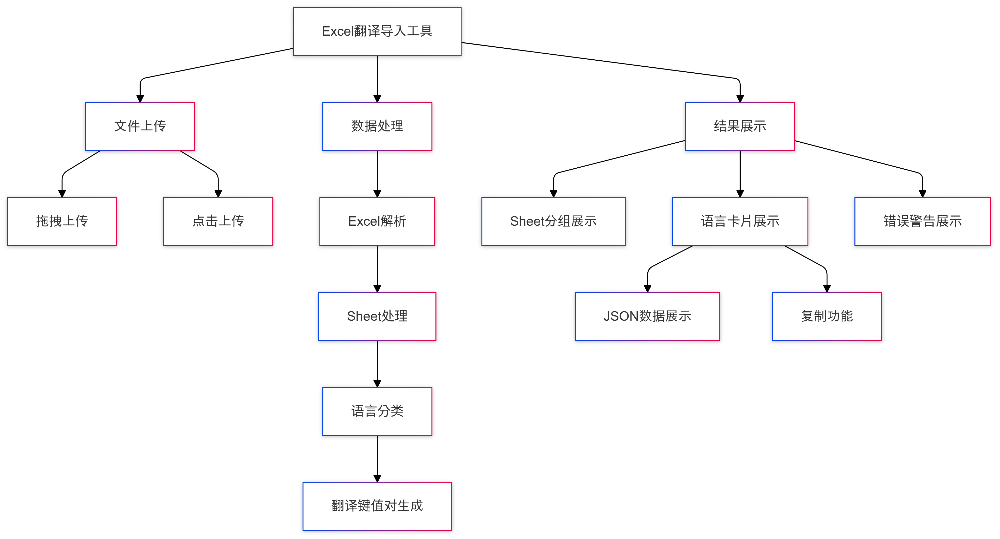

# 基于 Vue3 的 Excel 文件处理与多语言导出实现

## 前言
因为公司在做海外项目，需要中文、阿拉伯语、印尼语、波斯语、西班牙语等多语言。每次从 Excel 文档中复制翻译并手动整理非常耗时。因此，开发了一个工具来简化这个过程。
### 实现思路
1. 前端上传Excel文件，并解析文件，读取Excel文件数据
2. 对Excel文件数据进行处理，使用英语列截取前三个字符作为key，或者key+index作为key
3. 对处理后的数据展示出来，并提供复制功能和导出功能
### 思维导图



## 功能介绍
主要功能包括：

+ Excel 文件上传和解析
+ 多语言数据提取和处理
+ JSON 格式导出
+ 数据预览
+ 进度显示

## 技术栈
+ Vue 3
+ Element Plus
+ xlsx.js
+ Web Worker
+ File Saver

## 相关库
+ **sheetJs**: 一个可以读取、写入和操作Excel文件的JavaScript库。 [了解更多](https://xlsx.nodejs.cn/)
+ **js-export-excel**: 用于将数据导出为Excel文件的JavaScript库，主要功能是将JSON数据转换为Excel文件并提供下载。 [了解更多](https://www.npmjs.com/package/js-export-excel)
+ **FileReader**: 接口允许页面异步读取存储文件内容，使用File和Blob对象指定要读取的文件或数据。 [了解更多](https://developer.mozilla.org/zh-CN/docs/Web/API/FileReader)

## 核心实现
### 3.1 文件上传组件
```vue
<template>
  <el-upload
    ref="elUploadInstance"
    class="upload"
    action="#"
    drag
    multiple
    :auto-upload="false"
    :limit="1"
    :show-file-list="false"
    :on-change="getImportFile"
  >
    <el-icon class="el-icon--upload"><upload-filled /></el-icon>

    <div class="el-uploadtext">Drop file here or <em>click to upload</em></div>

  </el-upload>

</template>

```

### 3.2 文件验证
```javascript
const config = {
  acceptTypes: ['.xlsx', '.xls'],
  maxSize: 10 1024 1024, // 10MB
};
const getImportFile = (file) => {
  // 文件类型验证
  const extension = file.name.split('.').pop().toLowerCase();
  if (!config.acceptTypes.includes(.${extension})) {
    ElMessage.error(只支持 ${config.acceptTypes.join(', ')} 格式的文件);
    return false;
  }
  // 文件大小验证
  if (file.size > config.maxSize) {
    ElMessage.error(文件大小不能超过 ${config.maxSize / 1024 / 1024}MB);
    return false;
  }
  if (file.raw) {
    readFile(file.raw);
    elUploadInstance.value?.handleRemove(file);
  }
};
```

### 3.3 Web Worker 处理
```javascript
import as XLSX from 'xlsx';
self.onmessage = async (e) => {
  const { file } = e.data;
  try {
    const reader = new FileReader();
    reader.onload = function(e) {
      try {
        const data = processExcel(e.target.result);
        self.postMessage({ type: 'complete', data });
      } catch (error) {
        self.postMessage({ type: 'error', data: error.message });
      }
    };
    reader.onprogress = function(e) {
      if (e.lengthComputable) {
        const progress = Math.round((e.loaded / e.total) 100);
        self.postMessage({ type: 'progress', data: progress });
      }
    };
    reader.readAsBinaryString(file);
  } catch (error) {
    self.postMessage({ type: 'error', data: error.message });
  }
};
```

### 3.4 数据处理
```javascript
function processExcel(data) {
  const workbook = XLSX.read(data, { type: "binary" });
  const fanyi = [];

  workbook.SheetNames.forEach((sheetName, index) => {
    const worksheet = workbook.Sheets[sheetName];
    const sheetData = XLSX.utils.sheet_to_json(worksheet, {
      defval: "",
      blankrows: true,
    });

    if (!sheetData.length) return;

    const sheetTranslations = {};
    const langKeys = Object.keys(sheetData[0]).filter(
      (key) => key !== "key" && !key.includes("__EMPTY")
    );

    langKeys.forEach((language) => {
      const translations = {};
      sheetData.forEach((row, rowIndex) => {
        if (!row.en) return;

        if (row.hasOwnProperty("key")) {
          translations[row.key] = row[language];
        } else {
          translations[`key${rowIndex}`] = row[language];
        }
      });
      sheetTranslations[language] = translations;
    });

    fanyi[index] = sheetTranslations;
  });

  return fanyi;
}
```

### 3.5 数据导出
```javascript
const exportData = async () => {
  try {
    exporting.value = true;

    for (const sheet of fanyi.value) {
      for (const [lang, translations] of Object.entries(sheet)) {
        const blob = new Blob([JSON.stringify(translations, null, 2)], {
          type: "application/json;charset=utf-8",
        });
        saveAs(blob, `translations_${lang}.json`);
      }
    }

    ElMessage.success("导出成功");
  } catch (error) {
    console.error(error);
    ElMessage.error("导出失败");
  } finally {
    exporting.value = false;
  }
};
```

## 功能特点
1. **文件处理优化**
    - 使用 Web Worker 处理大文件
    - 实时进度显示
    - 文件类型和大小验证
2. **数据处理**
    - 支持多 Sheet 处理
    - 自动提取语言列
    - 空值检查和警告
3. **用户体验**
    - 拖拽上传
    - 进度显示
    - 预览功能
    - 一键导出

## 使用说明
1. Excel 文件格式要求：
    - 第一行为语言种类
    - 必须包含 "en" 列
    - 支持多个 Sheet
2. 操作步骤：
    - 上传 Excel 文件
    - 等待处理完成
    - 预览数据
    - 导出 JSON 文件

## 注意事项
1. 文件大小限制：10MB
2. 支持的文件格式：.xlsx, .xls
3. Excel 表格必须包含英语列
4. 建议使用现代浏览器以获得最佳体验

## 后续优化方向
1. 支持更多文件格式
2. 添加批量处理功能
3. 优化大文件处理性能
4. 添加更多数据验证规则
5. 支持自定义导出格式

## 总结
至此，一个翻译导出工具就完成了。通过使用 Web Worker、文件流处理等技术，实现了高效的文件处理和数据导出功能。也能满足开发日常导出翻译的需求，节省了不少时间。

## 源码附上
[源码地址](https://github.com/hongyingxin/excel-translator)
