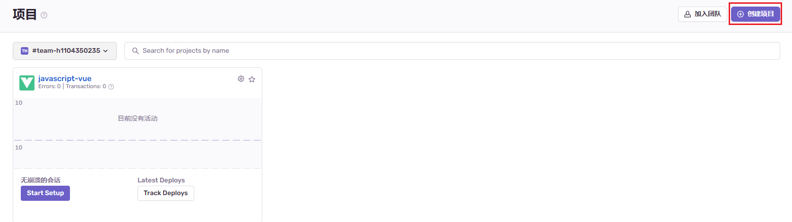
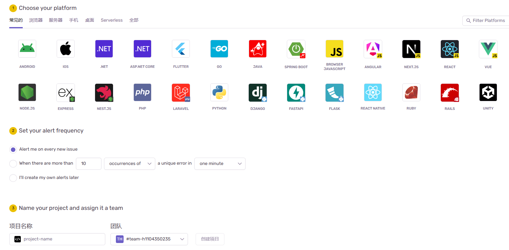
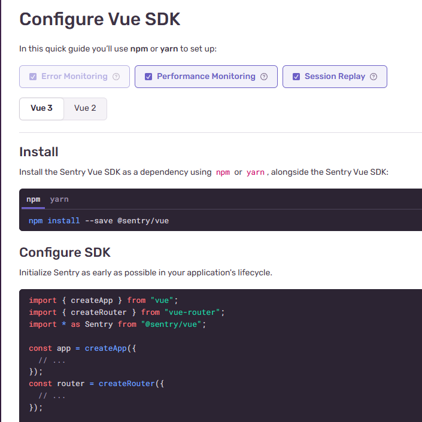
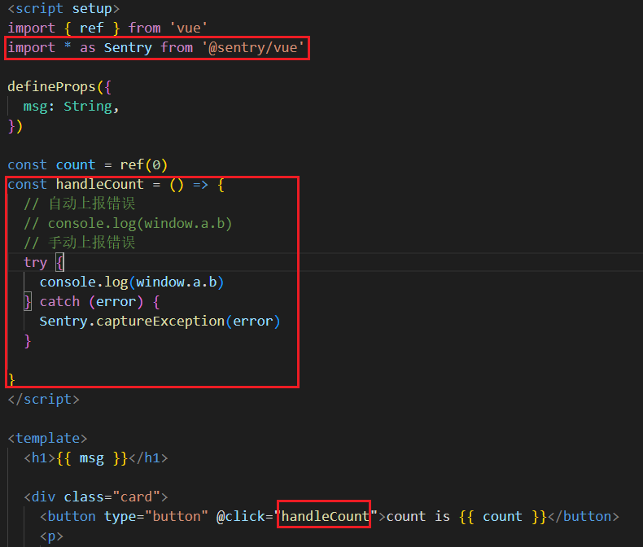
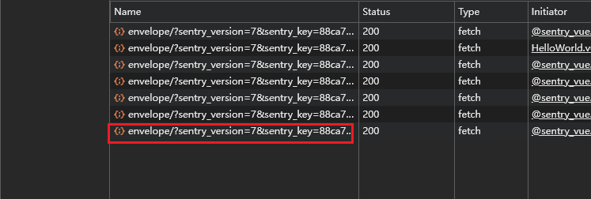
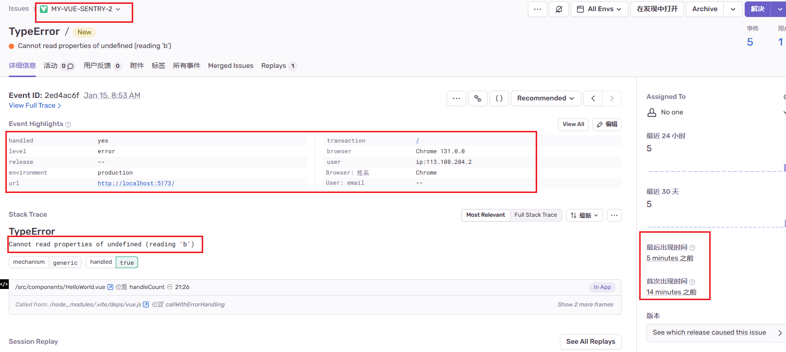

# 前端监控平台

## 前言
对于一个项目来说，监控平台是必不可少的。拥有一个监控平台，可以更好地了解项目运行情况，及时发现问题并解决问题。

## 想拥有一套自己的监控平台，无非两种方式

1. 自己搭建一套监控平台
2. 使用第三方监控平台

## 自己搭建一套监控平台

在前端监控中，捕获异常和错误都非常重要。目前共有四种方法来捕获前端错误：

1. **try...catch语句**
   ```js
   try {
     console.log(a);
   } catch (error) {
     console.log(error);
   }
   ```

2. **全局错误处理**
   ```js
   window.onerror = function (message, source, lineno, colno, error) {
     console.log(message, source, lineno, colno, error);
   };
   ```

3. **Promise错误处理**
   ```js
   Promise.reject(new Error('Promise error'));
   ```

4. **unhandledrejection事件**
   ```js
   window.addEventListener('unhandledrejection', function (event) {
     console.log(event.reason);
   });
   ```

因为本文不是讲自研监控平台搭建，所以就不详细展开了。

## 使用第三方监控平台

目前市面上有很多成熟的监控平台，比如：

1. **BugSnag**
   - BugSnag 由美国旧金山一家公司研发，是一个实时错误监控平台，支持多种编程语言和平台。能够提供详细的错误报告，支持自动捕获和通知错误。

2. **Fundebug**
   - Fundebug 由中国一个团队开发，专注于为前端和Node.js提供错误监控服务，目前支持前端JavaScript、微信小程序、React Native、Java、Node.js等，是一个完善的前端错误日志服务，但是收费。

3. **ARMS**
   - ARMS是阿里的一个前端数据监控服务，专注于对Web场景、Weex场景和小程序场景的监控，从页面打开速度、页面稳定性和外部服务调用成功率这三个方面监测Web和小程序页面的健康度，但是收费。

4. **Logan**
   - 美团点评集团推出的大前端日志系统，包括日志的收集存储，上报分析以及可视化展示。提供了五个组件，包括日志收集存储、Web SDK、后端日志存储分享Server、日志分析平台。

5. **Sentry**
   - Sentry是一个开源的实时错误监控项目，基于Django构建的现代化的实时事件日志监控、记录和聚合平台，主要用于快速发现故障。它支持多端配置，包括Web前端、服务器端、移动端、游戏端；支持多种语言，例如Python、Java、JavaScript等；支持多种前端框架，如Vue、React、Angular等。

   **优点**
   - 开源免费
   - 产品体验好，功能完善
   - 接入方便，工作量少
   - Sentry专注于 Error、Exception、Crash
   - 提供丰富的上下文信息，自动合并重复问题，邮件警告等

   **缺点**
   - 错误量大的时候会导致Sentry响应严重延迟
   - 部署依赖繁多，官方提供的Github仓库

## Sentry

Sentry 是一个开源的实时错误监控项目，它支持多端配置，包括 web 前端、服务器端、移动端、游戏端。基于 Django 构建的现代化的实时事件日志监控、记录和聚合平台，主要用于快速发现故障。更快地解决错误和性能问题，并从前端到后端不断了解应用程序运行状况。支持各种语言，例如 Python、OC、Java、Node、JavaScript 等。也可以应用到各种不同的框架上，如前端框架中的 Vue、Angular、React 等最流行的前端框架。提供了 GitHub、Slack、Trello 等常见开发工具的集成。可以自己安装并搭建 Sentry 应用。

使用 Sentry 的方法分为两种：
- **Sass**：最方便的使用方式，只是官方提供的 Sass 免费版只支持每天 5000 个 event。
- **私有化部署**：需要占用自己服务器的资源空间，但数据都存在本地，相对更安全。

## 创建一个 Sentry 项目

#### 1. 创建项目

1. 登录 Sentry 官网，创建一个属于你自己的账号。
   [Sentry官网](https://sentry.io/welcome/)
2. 从右上角的按钮点击 +Create Project 按钮创建一个新项目。
   
   - 根据需求选择你的框架或者语言。
   - 在 Set your alert frequency 下，选择提醒频率。
   - 最后在 Name your project and assign it a team 下，补充项目的名称以及所属团队。
   - 点击 Create Project 完成创建。
   

#### 2. 项目接入

在 Sentry 页面上创建完项目后，有一个新手指引，跟着新手指引，我们还是比较容易完成对项目的接入。


1. 安装相关依赖
   ```bash
   npm install --save @sentry/vue
   ```

2. 配置 Sentry
   ```javascript
   import App from './App.vue'
   import * as Sentry from '@sentry/vue'

   Sentry.init({
     // Vue 应用实例，以便 Sentry 可以与应用进行集成
     App,
     // 客户端密钥，可以通过进入项目 -》右上角设置 -》客户端密钥(DSN) 里面拷贝
     dsn: "https://88ca76f4e768c60384223ef3803cc366@sentry.vchat-onlie.com:443/29",
     // 配置 Sentry 的集成插件
     integrations: [
       // 用于浏览器端的性能监控
       Sentry.browserTracingIntegration(),
       // 用于会话重放功能
       Sentry.replayIntegration(),
     ],
     // 性能监控的采样率
     tracesSampleRate: 1.0, // 采样率为 1.0 表示采集 100% 的事务数据
     // 指定哪些 URL 应启用分布式追踪，可以是字符串或正则表达式
     tracePropagationTargets: ["localhost", /^https:\/\/yourserver\.io\/api/],
     // 会话重放的采样率
     replaysSessionSampleRate: 0.1, // 0.1 表示采集 10% 的会话
     // 在发生错误时会话重放的采样率
     replaysOnErrorSampleRate: 1.0, // 1.0 表示采集所有错误会话
   })
   ```
   Sentry 的 init 初始化方法如上所示，都写了注释说明，有兴趣的同学可以上官网查询更多。

#### 3. 测试阶段

1. Sentry 错误上报分为自动上报和手动上报。我们给按钮添加一个 handleCount 事件，当我们点击时会输出一个不存在的对象，触发报错。
   Sentry 提供以下上报 API:
   ```javascript
   // 上报一个错误
   function captureException(exception: any): string;
   // 上报一个文本消息
   function captureMessage(message: string, level?: Severity): string;
   // 上报一个手动创建的事件
   function captureEvent(event: Event): string;
   ```

   

2. 当页面初始化或者触发报错时，HTTP 会发送一个请求 https://sentry.vchat-onlie.com 将报错信息上传到 Sentry，说明接入成功。
   

3. 登录 Sentry 管理后台，我们就可以看到这条报错信息，包括报错首次出现时间，最后出现时间，版本号信息，用户浏览器信息等等。
   

## 完结

至此，通过完成上述的接入流程，如果使用的是 Sentry 的 Sass，那么就算是完成了。

## 后续

1. 完善 Sentry 管理平台的配置项。
2. 私有化部署，目前是使用官方提供的 Sass 服务，拓展需要收费。
3. 上传 sourcemap，因为部署的代码是打包编译过的，不好定位到线上 bug。

## 参考

- [文章demo](https://github.com/hongyingxin/demo)
- [掘金文章](https://juejin.cn/post/7211401380769513531)
- [阿里云文章](https://developer.aliyun.com/article/1293899)
- [CSDN文章](https://blog.csdn.net/weixin_46034375/article/details/123199179)