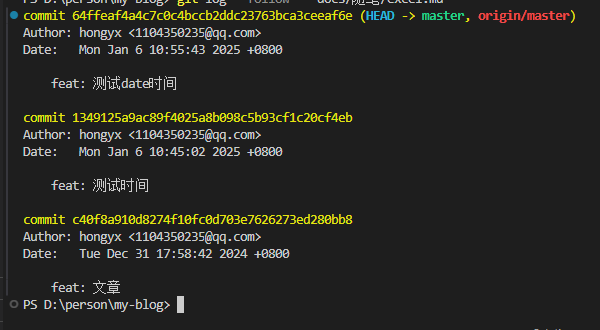
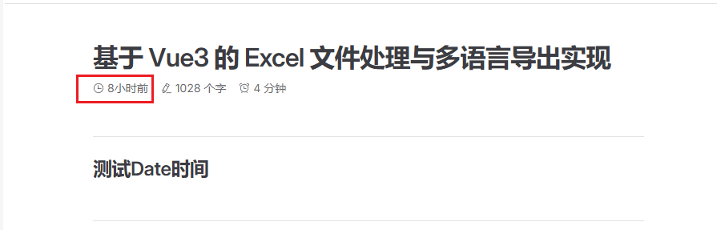
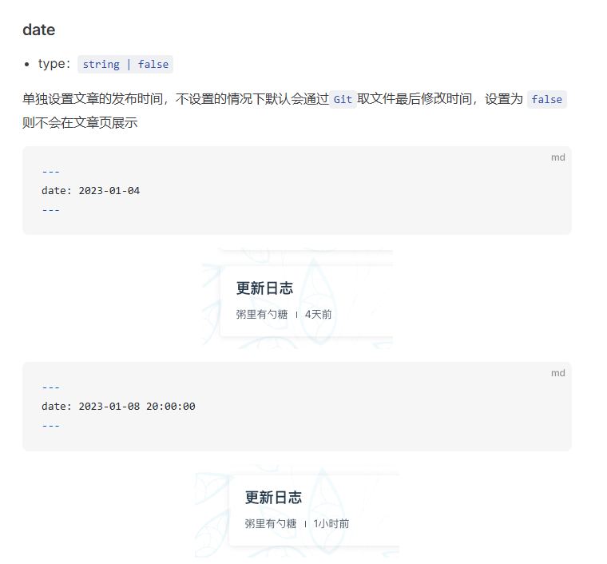

# 记一次博客时间显示问题

搭建的博客，文章列表时间显示不正确，每一次更新都是固定显示前八小时。在翻阅了主题配置文档后，发现也是没有问题。但固定8小时前，让我想到了 UTC +8 -8 的问题，于是将问题锁定在部署机器时区问题上。





经过 Google 和 GitHub Pages 文档，发现 GitHub Actions 部署时，默认使用 UTC 时间，需要手动设置时区为 Asia/Shanghai。

时区的问题解决后，发现所有文件的更新时间都是一样的，检查了 `git log` 文件更新，发现 Git 并没有问题。因为上一个问题也是 yml 脚本部署的问题，基本开始排查 yml 脚本。发现 yml 脚本中，设置 `fetch-depth: 0`，导致文件更新时间不正确。

## 解决方案

1. **设置时区：**

   在 `deploy.yml` 中通过设置环境变量 `TZ` 为 `Asia/Shanghai`，确保构建环境使用东八区时间。

   ```yaml
   - name: Set Timezone
     run: echo "TZ='Asia/Shanghai'" >> $GITHUB_ENV
   ```

2. **确保完整的 Git 历史：**

   在 `actions/checkout` 步骤中，设置 `fetch-depth` 为 `0`，以确保获取完整的 Git 历史，从而正确读取文件的最后修改时间。

   ```yaml
   - name: Checkout
     uses: actions/checkout@v4
     with:
       fetch-depth: 0
   ```

3. **调试和验证：**

   在构建过程中添加调试输出，确认时区设置和 Git 信息读取是否正确，方便排查问题。

   ```yaml
   - name: Check Current Time
     run: date

   - name: Check File Git Info
     run: git log -1 -- <file_name>
   ```

## 总结

此次的问题主要是 yml 脚本部署问题，因为对 yml 脚本不熟悉，导致问题排查困难。